# 🔐 Penetration Test Report — Starbucks (Simulated Environment)
**Conducted by:** Schnaith Services | **Course:** CIS 450 | **Classification:** Academic / Simulated

---

## 📋 Table of Contents

- [Executive Summary](#executive-summary)
- [Recommendations](#recommendations)
- [Objectives](#objectives)
- [Attack Narratives](#attack-narratives)
- [Technical Findings](#technical-findings)
  - [Testing Devices](#testing-devices)
  - [Responder](#-responder--high-severity)
  - [NMAP](#-nmap--high-severity)
  - [C2 and Agent (Mythic / Apollo)](#-c2-and-agent-mythic--apollo--high-severity)
  - [Vulnserver](#-vulnserver--low-severity)
  - [BloodHound](#-bloodhound--informational)
  - [LOLbins](#-lolbins--medium-severity)
- [Disclaimer](#disclaimer)

---

## Executive Summary

Schnaith Services was contracted to provide penetration testing services for a **simulated Starbucks environment** (academic exercise). The assessment was conducted using information provided to identify the scope of the penetration test.

The primary objectives were to **identify vulnerabilities** and **demonstrate the impact or risk** of a threat by exploiting discovered vulnerabilities. Using different attack vectors and means of entry into the network, multiple findings were uncovered and documented.

After careful consideration, a number of steps can be taken to reduce exposure. Recommendations tied to specific vulnerabilities are included in the findings below.

> _Schnaith Services thanks you for choosing us!_

---

## Recommendations

The following are listed in **order of importance** for ongoing risk mitigation:

| Priority | Recommendation |
|----------|---------------|
| 🔴 Critical | Remediate **critical** severity vulnerabilities as soon as possible |
| 🟠 High | Remediate **high** severity vulnerabilities within **30 days** |
| 🟡 Medium | Educate users to choose strong, non-guessable passwords; conduct periodic password audits |
| 🟡 Medium | Train employees on the dangers of **phishing** |
| 🟡 Medium | **Close unused ports** on all machines |
| 🟢 Standard | Implement **two-factor authentication (2FA)** |
| 🟢 Standard | Add restrictions on Windows binaries not essential to operations |
| 🟢 Standard | Deploy network **listeners** to monitor for suspicious activity |
| 🟢 Standard | Use **BloodHound** to visualize and audit Active Directory |
| 🟢 Standard | Restrict downloads and enforce allow-list policies for download sources |
| ℹ️ Future | Schedule a follow-up penetration test with Schnaith Services |

---

## Objectives

The main goals of this penetration test were:

- 🎯 Attempt to compromise internal assets from external or publicly available network assets
- 🎯 Attempt to **escalate privileges** and gain high-level access
- 🎯 Use methods to obtain **sensitive information** about the network
- 🎯 Demonstrate the **impact or risk** of a threat exploiting existing vulnerabilities

---

## Attack Narratives

### 🖥️ Insider Threat / Rogue Device

This narrative attempts to understand the extent to which a **malicious actor with physical access** to network infrastructure could disclose, destroy, or alter information assets — in short, what an attacker can do by plugging into an open network port.

Using **Kali Linux**, tools such as **Nmap** and **Responder** were leveraged for network scanning and information gathering.

### 🎣 Assume Breach / Ceded Access

The "assume breach" scenario assumes that a user in the environment will eventually be **compromised through phishing or a drive-by exploit**. This scenario is common enough to warrant a thorough understanding of its impact.

From a ceded host, tools including **C2 (Mythic/Apollo)**, **BloodHound**, **Vulnserver**, and **LOLbin exploits** were used to demonstrate attacker advantage.

---

## Technical Findings

### Testing Devices

The engagement used virtual machines on a **closed, simulated network** designed to mimic real-world Starbucks infrastructure.

| Role | OS | IP Address | Hostname |
|------|----|-----------|----------|
| Rogue Device (Attacker) | Kali GNU Linux | `192.168.1.118` | `kali-Template-2022` |
| Ceded Access (Victim) | Microsoft Windows 10 | `192.168.1.111` | `DESKTOP-8MB63J7` |

**Figure 1 — Kali Linux VM specs in VMware**

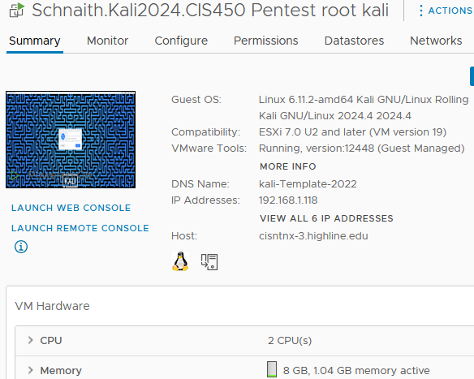

**Figure 2 — Windows 10 VM in VMware**

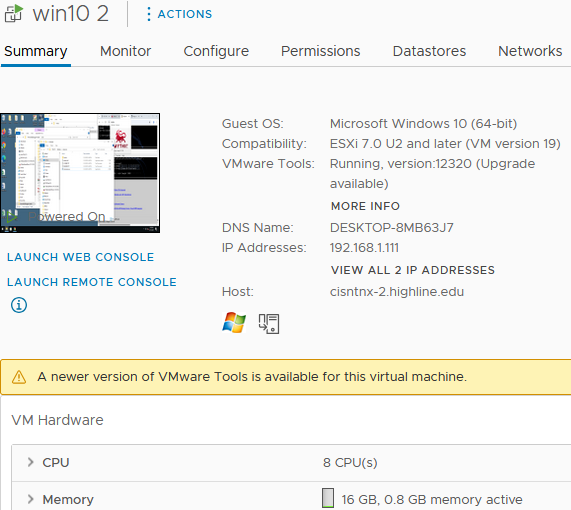

---

### 🔴 Responder — High Severity

#### Description

**LLMNR (Link-Local Multicast Name Resolution)** is a Windows protocol used for name resolution when DNS queries fail. It allows devices on the same network to resolve names without a DNS server. While helpful in some environments, LLMNR poses a significant security risk.

**Responder** was used to exploit this vulnerability, targeting the Windows machine on the network to intercept and capture password hashes.

#### Severity

> 🔴 **HIGH** — Passwords being cracked remotely is a critical risk.

#### Recommendations

- **Disable LLMNR globally** across the environment
- Implement a more advanced, up-to-date DNS infrastructure
- Add **two-factor authentication** to mitigate the impact of cracked password hashes

#### Artifacts

**Figure 3 — Kali Linux machine starting up Responder**

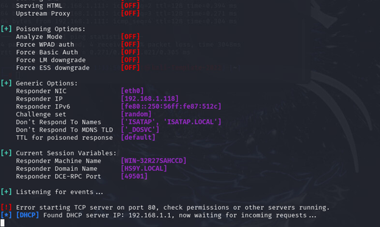

**Figure 4 — Responder finding the password hash for the Windows machine**

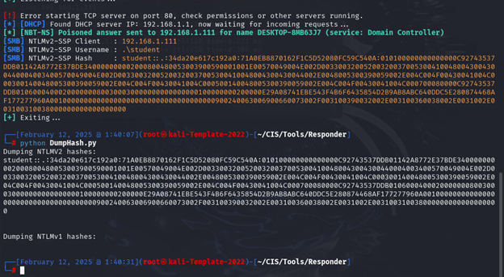

---

### 🔴 NMAP — High Severity

#### Description

**Nmap (Network Mapper)** is a powerful open-source tool used for network discovery, security auditing, and vulnerability assessment. It allows testers to scan networks, identify active hosts, discover open ports, and enumerate operating system and service information.

Nmap was used to scan the Windows target machine, revealing open ports and detailed system information.

#### Severity

> 🔴 **HIGH** — Open ports being discovered and listened to is a high severity threat.

#### Recommendations

- Establish a protocol to **close and firewall ports** when not in use
- Prevent external enumeration of operating system details and running services

#### Artifacts

**Figure 5 — Kali machine using Nmap to scan ports on the Windows machine**

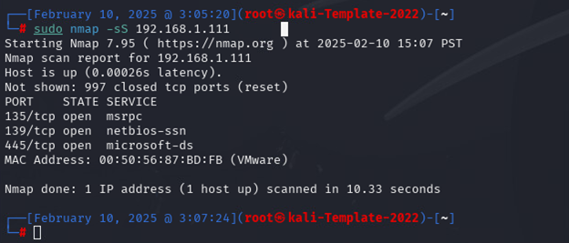

**Figure 6 — Kali machine running a deeper Nmap scan for OS and service info**

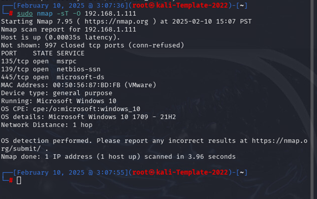

---

### 🔴 C2 and Agent (Mythic / Apollo) — High Severity

#### Description

**Mythic** is a Command & Control (C2) framework used for exploitation and red team operations. It enables testers to create and deploy payloads against vulnerable machines, simulating how **malware can spread** through a compromised system.

The **Apollo agent** was used in conjunction with Mythic to establish a C2 connection to the Windows target.

#### Severity

> 🔴 **HIGH** — This vulnerability can be exploited via phishing, providing full remote control of a compromised machine.

#### Recommendations

- Place **strict restrictions on downloads** and which sources are permitted
- Conduct **phishing awareness training** for all employees

#### Artifacts

**Figure 7 — Mythic C2 creating Apollo payloads**

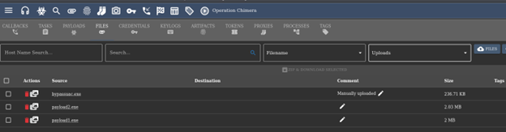

---

### 🟢 Vulnserver — Low Severity

#### Description

**Vulnserver** is a deliberately vulnerable application that enables testers to practice real-world **buffer overflow and binary exploitation** attacks on a Windows environment. Scripts were used to attack the vulnerable server running on the Windows machine.

#### Severity

> 🟢 **LOW** — While the binary scripts worked in this controlled environment, protective firewalls are typically in place to prevent this in production.

#### Recommendations

- Keep all standard firewalls active and up to date
- Continue to **close unused ports**
- Add **specific restrictions on Windows binary execution** to limit attack surface

#### Artifacts

**Figure 8 — Kali machine running fuzzing scripts against the vulnerable server**

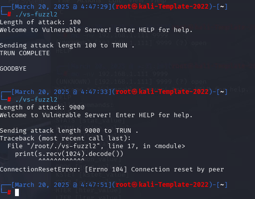

**Figure 9 — Immunity Debugger set up with Vulnserver**

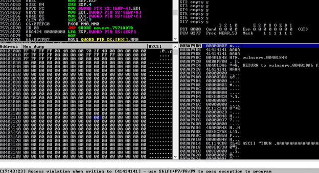

**Figure 10 — msfvenom crafting shellcode targeting the Windows machine**

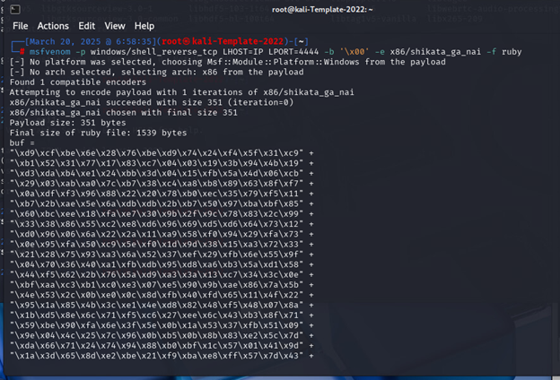

---

### ℹ️ BloodHound — Informational

#### Description

**BloodHound** is an open-source tool that **visualizes Active Directory** relationships and trust paths. It is particularly effective at highlighting **privilege escalation paths** within a network. BloodHound was used with sample data in this scenario.

#### Severity

> ℹ️ **INFORMATIONAL** — No direct exploitation; used to identify and visualize potential attack paths.

#### Recommendations

- Run BloodHound against your **own Active Directory** to proactively discover privilege escalation risks
- Use the visual output to prioritize remediation of high-risk relationships

#### Artifacts

**Figure 11 — BloodHound visualization of all Domain Admin group members**

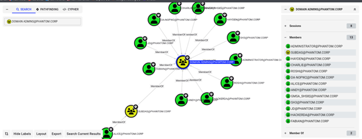

**Figure 12 — BloodHound highlighting David's ability to escalate his own privileges**

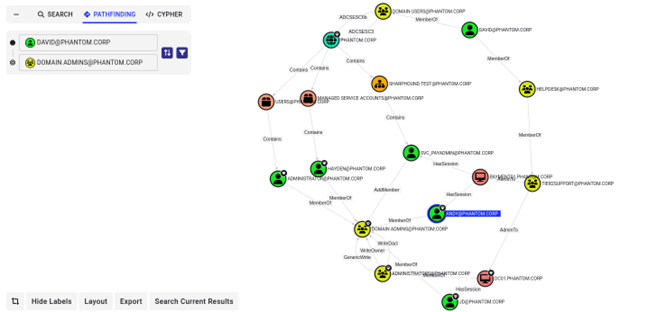

---

### 🟡 LOLbins — Medium Severity

#### Description

**LOLbins (Living Off the Land Binaries)** refer to Windows binaries, scripts, and libraries that are **pre-installed on the system** and can be abused by attackers. The ones highlighted in this assessment are those most commonly misused and most vulnerable to exploitation without introducing additional malware.

#### Severity

> 🟡 **MEDIUM** — Attackers can leverage legitimate system tools to evade detection.

#### Recommendations

- Use endpoint management tools to **restrict execution of non-essential Windows binaries**
- Deploy **listeners and behavioral monitoring** to detect malicious use of native binaries before damage occurs

---

## Disclaimer

> ⚠️ This report was produced as part of an **academic penetration testing exercise** for CIS 450. All testing was conducted on a **closed, simulated network** designed to replicate a real-world environment. No actual Starbucks systems, networks, or data were accessed or affected at any time. All findings are for **educational purposes only**.
