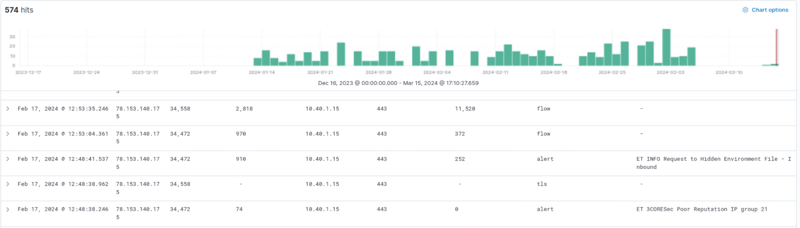
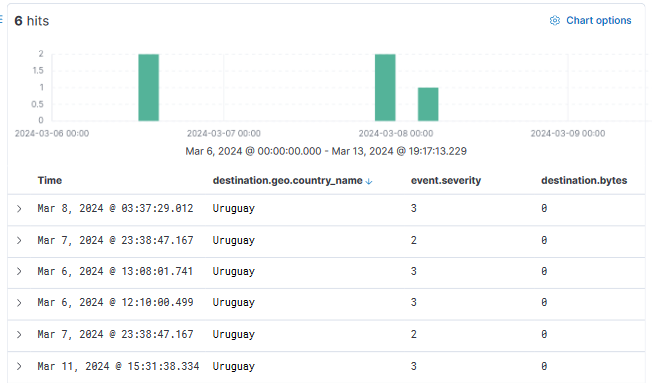
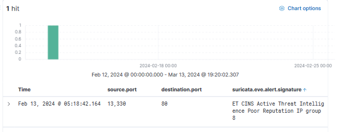

Here, is a project report of security analysis work done with a real company based in burien. 

# 🛡️ Security Analysis Report — Burien Municipal Network
**Conducted by:** Green Team (Darci, Kyle, William Schnaith, Dylan, Edith, Chris)
**Client:** City of Burien | **Classification:** Academic / Simulated

---

## 📋 Table of Contents

- [Executive Summary](#executive-summary)
- [Findings & Recommendations](#findings--recommendations)
  - [ConnectWise ScreenConnect Auth Bypass](#-connectwise-screenconnect-auth-bypass--cve-2024-1709)
  - [Chains of Communication from Malicious Subnet](#-chains-of-communication-from-malicious-subnet)
  - [Geolocation Connection Security](#-geolocation-connection-security)
  - [Phishing Awareness Training](#-organization-wide-phishing-awareness-training)
  - [Security/Web Vendor Scanning False Positives](#-securityweb-vendor-scanning-false-positives)
- [Disclaimer](#disclaimer)

---

## Executive Summary

In response to the evolving threat landscape, our team conducted **33 comprehensive investigations** focusing on key areas of concern within the Burien municipal network. These investigations delved into:

- Data movement patterns
- The origin of "North/South" network traffic
- Alert signatures of well-known malware
- Indicators of malicious use of legitimate platforms
- Municipal network user behavior

Our analysis revealed primary domains of observed or assumed malicious traffic, notably encompassing **web scanning**, **file sharing**, **simulated phishing campaigns**, and **initial entry attempts** through vulnerability enumeration and exploitation.

Based on our findings, we have formulated formal recommendations aimed at bolstering the resilience and efficacy of the network's security posture.

---

## Findings & Recommendations

### 🔴 ConnectWise ScreenConnect Auth Bypass — CVE-2024-1709

#### Key Findings

- ConnectWise ScreenConnect initial entry vectors were observed multiple times
- Mass exploitation attempts have been observed since public disclosure
- Malicious follow-on actions post-exploit include **ransomware and extortion schemes**

#### Summary & Recommendation

ConnectWise ScreenConnect's recent vulnerabilities (CVE-2024-1709 and CVE-2024-1708) have led to widespread exploitation, prompting urgent action from both ConnectWise and security experts. Security vendors such as Mandiant and Sophos X-Ops emphasize immediate isolation and patching of vulnerable instances.

Network administration teams should take the following actions:

| Action | Details |
|--------|---------|
| 🔍 Inventory | Identify all instances of ConnectWise ScreenConnect in the network |
| 🔧 Patch | Upgrade to v23.9.10.8817 or v22.4 immediately |
| 👁️ Monitor | Implement detection mechanisms for suspicious post-exploit activity |
| 🧪 Test | Conduct regular vulnerability assessments and penetration testing |

---

### 🔴 Chains of Communication from Malicious Subnet

#### Key Findings

- Tickets **0005561** and **0005966** show communication to/from two malicious IPs on the same compromised subnet (`78.153.140.175` and `78.153.140.173`)
- Traffic first observed on **1/13/2024**, with events stopping around **3/5/2024** (assumed blocked)
- As of **3/14/2024**, flow events from the IP were still being received with no return traffic due to blocking
- Alerts included **"Poor Reputation IP"** and **"Request to Hidden Environment File"** signatures
- Flow events with bytes in the **tens of thousands** were still occurring despite alerts

#### Summary & Recommendation

This IP range was flagged for having compromised hosts. Multiple alerts were generated pairing poor reputation IP group warnings with requests to hidden environment files — traffic that should not be occurring in a production environment.

- Ensure the flagged IPs are **blocked across all monitored clients**
- Implement a method to **block IPs sooner** when they trigger poor reputation alerts
- In a production environment, there is no reason to allow traffic from flagged IPs — heed the warnings immediately

#### Artifacts

**Figure 1 — Last 90 days of traffic from/to known malicious IPs, showing alerts and continued flow events**

---

### 🟡 Geolocation Connection Security

#### Key Findings

- Alerts from sources **outside the country** are a common theme in Suricata
- Threat hunting revealed geolocation threats including connections from **Uruguay** and **China**
- Some threats are small enough to fly under the radar and are attempted repeatedly

#### Summary & Recommendation

Threat hunting in Elastic revealed many attempted connections from out-of-country hosts. While connections from Canada were common, less trustworthy connections originated from **Uruguay** and **China**. The Uruguay connections alone had been attempting to connect for over **90 days**, flooding Suricata with alerts.

While individually weak, these connections allow attackers to gather information on how their attacks are handled. Recommendations include:

- Implement a **firewall blocking connections** from countries that do not regularly interact with the network
- Continue building the **blocked countries, hostnames, and IPs list** as threats emerge
- Any measure that makes an attacker's job harder is a net positive for network security

#### Artifacts

**Figure 2 — Elastic screenshot showing a reported connection attempt from China**

**Figure 3 — Elastic screenshot showing a week's worth of attempted connections from Uruguay**

---

### 🟡 Organization-Wide Phishing Awareness Training

#### Key Findings

- Multiple alerts were caught for **links being followed from phishing test emails** sent by training vendors
- Vendor IP address and domain inventories could help reduce false positives
- Visibility into these events is still valuable — alerts should still fire on these domains

#### Summary & Recommendation

The observed influx of traffic to simulated phishing domains (e.g., `payments.crypto.us`) underscores the critical importance of robust phishing mitigation strategies. While end users remain the first line of defense, their susceptibility highlights the need for proactive measures.

| Recommendation | Details |
|---------------|---------|
| 🎓 Training | Regular phishing awareness training to recognize red flags (generic messages, unknown senders, suspicious links, urgency) |
| 🧪 Simulation | Conduct regular phishing simulation exercises to assess network readiness |
| 🔐 Passwords | Enforce strong, unique passwords with regular rotation and password managers |
| 📲 MFA | Implement **multifactor authentication** across all accounts |

---

### 🟢 Security/Web Vendor Scanning False Positives

#### Key Findings

- Extraordinary amounts of alerts were found to be generated by **benign web scanning**
- Multiple hours of threat hunting were dedicated to identifying false positives
- False positives **decrease team efficiency** and **increase blind spots**

#### Summary & Recommendation

Network monitoring sensors encountered numerous false positives from routine web scanning by content scrapers and security vendors. Suricata rules lacked precision in differentiating benign scans from malicious activity.

Recommendations to reduce false positives:

- **Tailor Suricata rules** to match the specific network environment and traffic patterns
- **Avoid overly broad rules** that trigger on benign activity
- Regularly **tune and update rules** based on monitoring feedback
- Utilize Suricata's built-in features: **thresholding**, **flowbit manipulation**, and **custom rule creation**

---

## Disclaimer

> ⚠️ This report was produced as part of an **academic security analysis exercise**. All investigations were conducted on data from a monitored municipal network environment in an educational context. All findings and recommendations are for **educational and professional development purposes only**.
