# 🎯 Enterprise Penetration Test — Simulated Engagement

> **Full-scope pentest with findings mapped to MITRE ATT&CK to inform detection engineering.** Two attack narratives (insider threat + assume breach) demonstrate how an attacker progresses through an enterprise — and where a SOC has the leverage to stop them.

**Conducted by:** Schnaith Services · **Course:** CIS 450 · **Classification:** Academic / Simulated

---

## 🎯 SOC Skills Demonstrated

| Skill | Evidence |
|---|---|
| **MITRE ATT&CK Mapping** | Each finding tagged to the technique a defender would use to hunt it |
| **Adversary Tradecraft** | Direct hands-on with Responder, Mythic C2, BloodHound, LOLbins |
| **Detection Engineering** | Each finding includes the detection opportunity it creates |
| **Severity Triage** | Findings rated Critical/High/Medium/Low/Informational with rationale |
| **Formal Reporting** | Executive summary + technical findings + tiered remediation |

---

## 📋 Executive Summary

Schnaith Services was contracted to provide penetration testing services for a **simulated Starbucks environment**. The assessment used real attacker tooling against scoped targets to identify vulnerabilities and demonstrate the impact of a successful exploit.

The engagement produced findings across two attack narratives — **insider threat / rogue device** and **assume breach / ceded access** — each representing a distinct entry point a SOC would need to detect.

---

## 🗺️ MITRE ATT&CK Coverage Summary

| Finding | ATT&CK Tactic | Technique | Severity |
|---|---|---|---|
| Responder LLMNR Poisoning | Credential Access | [T1557.001](https://attack.mitre.org/techniques/T1557/001/) — LLMNR/NBT-NS Poisoning | 🔴 High |
| Nmap Reconnaissance | Discovery | [T1046](https://attack.mitre.org/techniques/T1046/) — Network Service Scanning | 🔴 High |
| Mythic C2 + Apollo Agent | C2 / Execution | [T1071](https://attack.mitre.org/techniques/T1071/), [T1059](https://attack.mitre.org/techniques/T1059/) | 🔴 High |
| LOLbin Abuse | Defense Evasion | [T1218](https://attack.mitre.org/techniques/T1218/) — System Binary Proxy Execution | 🟡 Medium |
| BloodHound AD Enumeration | Discovery | [T1087](https://attack.mitre.org/techniques/T1087/) — Account Discovery | ℹ️ Informational |
| Vulnserver Buffer Overflow | Execution | [T1203](https://attack.mitre.org/techniques/T1203/) — Exploitation for Client Execution | 🟢 Low |

---

## 🎬 Attack Narratives

### 🖥️ Narrative 1 — Insider Threat / Rogue Device

A malicious actor with **physical access** plugs into an open network port. Using Kali Linux, the attacker leverages **Nmap** for reconnaissance and **Responder** for credential capture.

**SOC focus:** detect anomalous LLMNR/NBT-NS responses, unusual NTLM-relay patterns, and high-rate port scanning from new MAC addresses.

### 🎣 Narrative 2 — Assume Breach / Ceded Access

A user gets compromised through **phishing** or a drive-by exploit. From the ceded host, the attacker pivots with **Mythic C2 + Apollo**, **BloodHound**, **Vulnserver**, and **LOLbins**.

**SOC focus:** outbound C2 beacon detection, abnormal `living-off-the-land` binary execution, AD enumeration patterns (BloodHound's SharpHound generates distinctive LDAP queries).

---

## 🧪 Test Environment

| Role | OS | IP | Hostname |
|---|---|---|---|
| Rogue Device (Attacker) | Kali GNU/Linux | `192.168.1.118` | `kali-Template-2022` |
| Ceded Access (Victim) | Microsoft Windows 10 | `192.168.1.111` | `DESKTOP-8MB63J7` |

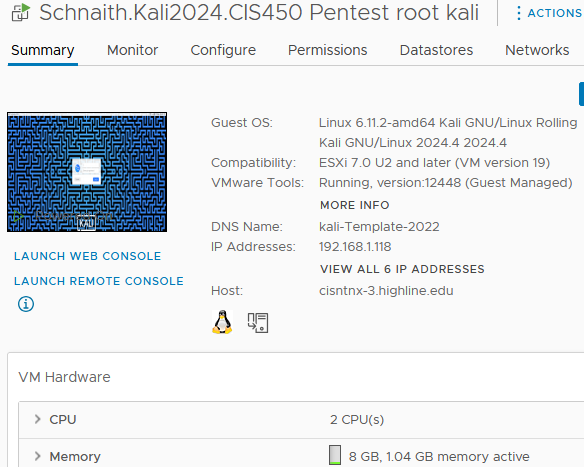

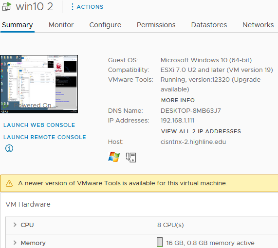

---

## 🚨 Technical Findings

### 🔴 Finding 1 — Responder (LLMNR Poisoning)

**Severity:** High · **ATT&CK:** [T1557.001](https://attack.mitre.org/techniques/T1557/001/) — LLMNR/NBT-NS Poisoning and SMB Relay

LLMNR is a Windows fallback name-resolution protocol that broadcasts queries when DNS fails. Responder masquerades as the requested host and captures NTLM hashes from clients that trust the response.

**Detection opportunity for SOC:**
- Alert on **broadcast responses** to LLMNR/NBT-NS queries from unexpected sources
- Monitor for sudden spikes in **NTLM authentication failures**
- Detect the Responder tool signature (default banner, port 5355 anomalies)

**Recommendations:**
- **Disable LLMNR** globally via Group Policy
- Modernize DNS infrastructure
- Enforce **MFA** to limit value of captured hashes

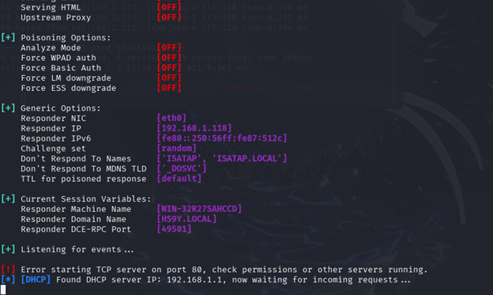

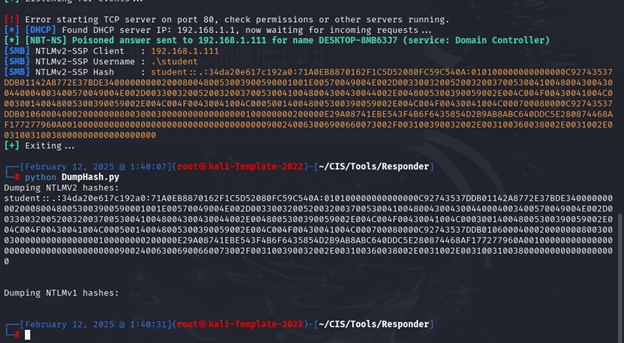

---

### 🔴 Finding 2 — Nmap Network Discovery

**Severity:** High · **ATT&CK:** [T1046](https://attack.mitre.org/techniques/T1046/) — Network Service Scanning

Nmap was used to map active hosts, enumerate open ports, and fingerprint the OS and running services on the Windows target.

**Detection opportunity for SOC:**
- Snort/Suricata signatures for high-rate SYN traffic from a single source
- Anomaly detection on connection attempts to many ports from one host
- IDS rules for OS-fingerprinting traffic patterns (Nmap's `-O` flag is fingerprintable)

**Recommendations:**
- Establish a protocol to **close and firewall unused ports**
- Block external OS / service enumeration via firewall
- Implement **rate limiting** at the perimeter

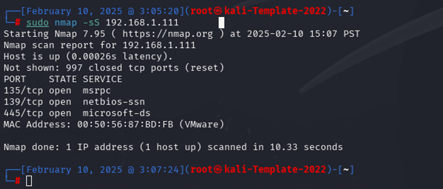

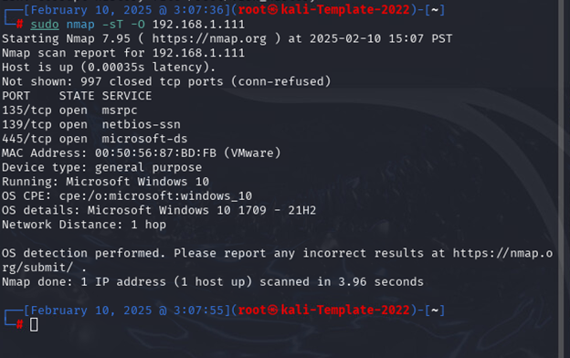

---

### 🔴 Finding 3 — Mythic C2 + Apollo Agent

**Severity:** High · **ATT&CK:** [T1071](https://attack.mitre.org/techniques/T1071/) — Application Layer Protocol, [T1059](https://attack.mitre.org/techniques/T1059/) — Command and Scripting Interpreter

Mythic is a modular C2 framework; the Apollo agent provides a C# Windows implant capable of full remote control.

**Detection opportunity for SOC:**
- Outbound beaconing patterns (regular intervals, low jitter, encrypted payloads)
- Unusual process spawning from common targets (Office apps spawning PowerShell)
- TLS JA3 fingerprinting of known C2 frameworks
- DNS request patterns to attacker-controlled domains

**Recommendations:**
- Strict download restrictions and application allow-listing
- Phishing-awareness training (most C2 starts with a phishing payload)
- Egress filtering and TLS inspection at the perimeter

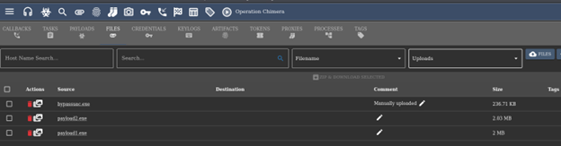

---

### 🟢 Finding 4 — Vulnserver Buffer Overflow

**Severity:** Low · **ATT&CK:** [T1203](https://attack.mitre.org/techniques/T1203/) — Exploitation for Client Execution

Vulnserver is a deliberately-vulnerable Windows TCP server used to practice buffer overflow techniques. Fuzzing scripts identified the offset, and `msfvenom` was used to craft a working shellcode payload.

**Detection opportunity for SOC:**
- Crash logs from production services (BoF often crashes the service before/during exploitation)
- Endpoint protection for shellcode execution patterns (DEP/ASLR violations)
- Unexpected outbound connections from server processes

**Recommendations:**
- Maintain firewalls and **close unused ports**
- Restrict execution of non-essential Windows binaries
- Modern Windows + EDR catches most reflective shellcode

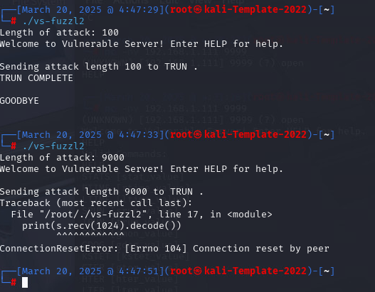

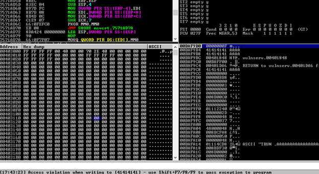

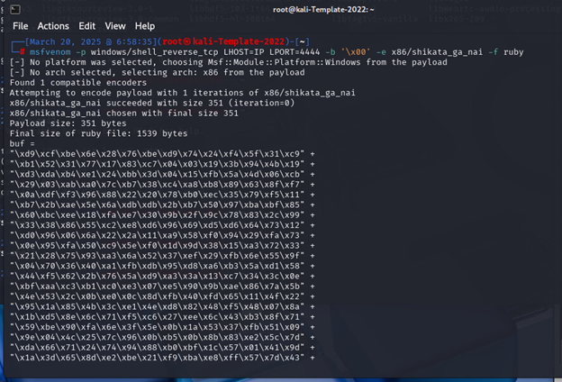

---

### ℹ️ Finding 5 — BloodHound AD Enumeration

**Severity:** Informational · **ATT&CK:** [T1087](https://attack.mitre.org/techniques/T1087/) — Account Discovery

BloodHound visualizes Active Directory relationships and surfaces privilege-escalation paths attackers can chain together.

**Detection opportunity for SOC:**
- LDAP query patterns from SharpHound (distinctive heavy query bursts)
- Endpoint detection for SharpHound binary execution
- Use BloodHound **defensively** to find and remediate privilege paths first

**Recommendations:**
- Run BloodHound against your **own AD** to find escalation paths
- Prioritize remediation of high-risk relationships (e.g. unintended `GenericAll` rights)

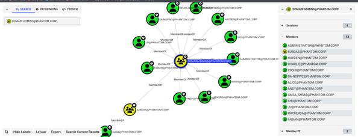

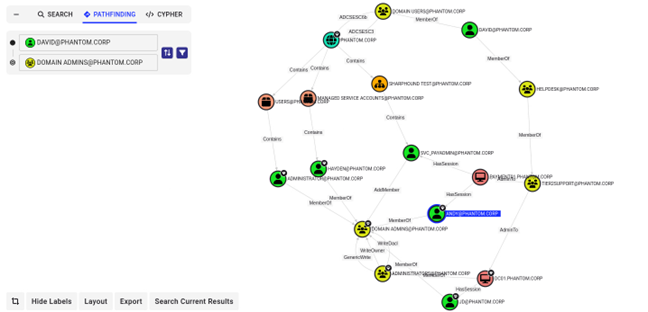

---

### 🟡 Finding 6 — LOLbin Abuse

**Severity:** Medium · **ATT&CK:** [T1218](https://attack.mitre.org/techniques/T1218/) — System Binary Proxy Execution

LOLbins (Living-Off-the-Land Binaries) are pre-installed Windows binaries (e.g. `certutil`, `regsvr32`, `mshta`) attackers abuse to evade detection because the binaries themselves are trusted.

**Detection opportunity for SOC:**
- Behavioral EDR rules for abnormal LOLbin invocation (e.g. `certutil` with `-urlcache` flag)
- Sysmon process-creation logging with command-line capture
- Parent-child process anomalies (Office spawning `cmd.exe` spawning `regsvr32`)

**Recommendations:**
- Application-control policies (WDAC, AppLocker)
- Deploy EDR with behavioral-based LOLbin detection rules
- Centralize Sysmon logs in the SIEM with curated detection rules

---

## 📊 Tiered Remediation Recommendations

| Priority | Recommendation |
|---|---|
| 🔴 Critical | Remediate critical-severity vulnerabilities immediately |
| 🟠 High | Remediate high-severity within 30 days |
| 🟡 Medium | User training (phishing, password hygiene); close unused ports |
| 🟢 Standard | Enforce 2FA across all accounts |
| 🟢 Standard | Application-control (allow-list) on Windows binaries |
| 🟢 Standard | Deploy network listeners / SIEM monitoring for suspicious behavior |
| 🟢 Standard | Audit Active Directory regularly with BloodHound |
| 🟢 Standard | Restrict downloads to allow-listed sources |
| ℹ️ Future | Schedule a follow-up engagement to validate remediation |

---

## 📄 Full Report

📑 [Schnaith-1_FinalReport_CIS450.docx](docs/Schnaith-1_FinalReport_CIS450.docx)

---

## ⚠️ Disclaimer

This report was produced as part of an **academic penetration testing exercise** for CIS 450. All testing was conducted on a **closed, simulated network** designed to replicate a real-world environment. No actual Starbucks systems, networks, or data were accessed or affected. All findings are for **educational purposes only**.
