# 🔵🔴 Red/Blue Team Exercise — Snort vs. Hashcat

> **Defensive hardening blocked 100% of attempted attacks.** Built a 6-host virtualized network from scratch, hardened it as the blue team, then attempted to penetrate the opposing team's infrastructure with industry-standard offensive tooling.

**Team SNORT:** William Schnaith, Nassiah Almonte, Cesar Rodriguez-Ortiz, Lince Gombo
**Opposing Team:** HASHCAT · **Window:** 2023-07-10 · **Scope:** `192.168.2.0/24`

---

## 🎯 SOC Skills Demonstrated

| Skill | Evidence |
|---|---|
| **Network Hardening** | OS patching, firewall rules, password policy, OpenVAS pre-engagement scans |
| **IDS/IPS Deployment** | Snort listener on Ubuntu monitoring all inbound traffic |
| **Traffic Analysis** | Wireshark live captures during attack window |
| **Vulnerability Mgmt** | OpenVAS scan + remediation cycle before exposure |
| **Attack Recognition** | Direct experience with Metasploit, Armitage, Nmap so detection rules can be designed accurately |
| **Authorization & Scoping** | Drafted and signed formal pentest contract with rules of engagement |

---

## 🔵 Blue Team Outcome

**Result:** All exploit attempts from Team HASHCAT were defeated by hardening:

- ❌ Metasploit MySQL credential attack → **connection refused**
- ❌ Metasploit MS08-067 (NetAPI) SMB exploit → **no session created**
- ❌ Armitage Hail Mary automated multi-exploit → **no sessions across any host**
- ✅ Several hardened hosts returned **unidentifiable** in Nmap scans

**Lesson for SOC:** Effective hardening doesn't just block compromise — it shapes scan output, denies OS fingerprinting, and forces attackers into noisier behavior that's easier to detect.

---

## 📋 Engagement Setup

### Contract & Rules of Engagement

Both teams signed a formal **Penetration Testing Contract** before any traffic flowed. The contract defined:
- All in-scope assets and IP ranges (`192.168.2.0/24`)
- Testing window: **Saturday, 2023-07-10** (12:00 AM – 11:59 PM)
- Client (HASHCAT) and Provider (SNORT) signatures and dates

### Network Topology

Six hosts on an internal switch, each behind a virtual firewall, with external traffic routed through pfSense:

| Host | OS | IP | Role |
|---|---|---|---|
| Exploitable Workstation | Windows 10 | `192.168.5.207` | Intentionally vulnerable target |
| Linux Workstation | Ubuntu | `192.168.5.201` | Standard workstation |
| Windows Workstation | Windows 10 | `192.168.5.203` | Standard workstation |
| Domain Controller | Windows Server | `192.168.5.204` | AD DC |
| Member Server | Windows Server | `192.168.5.202` | Member server |
| Linux Server | Linux | `192.168.5.206` | Linux server |

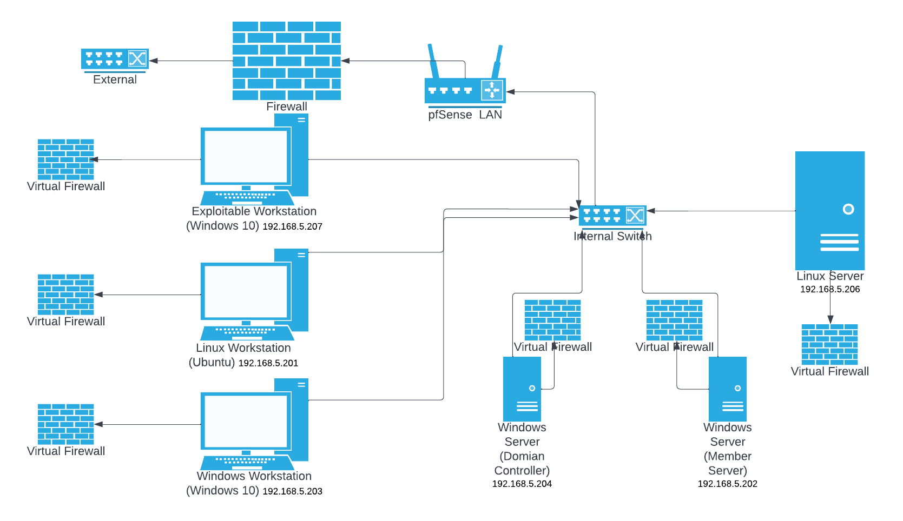

---

## 🛡️ Pre-Engagement Hardening (Blue Team)

| Layer | Action |
|---|---|
| **Vulnerability scan** | OpenVAS run against all internal hosts; remediated findings before exposure |
| **Patching** | All operating systems and software updated to latest versions |
| **Firewalls** | Virtual firewalls on every host; restricted inbound/outbound to required services |
| **Password policy** | Strong passwords enforced across all accounts |

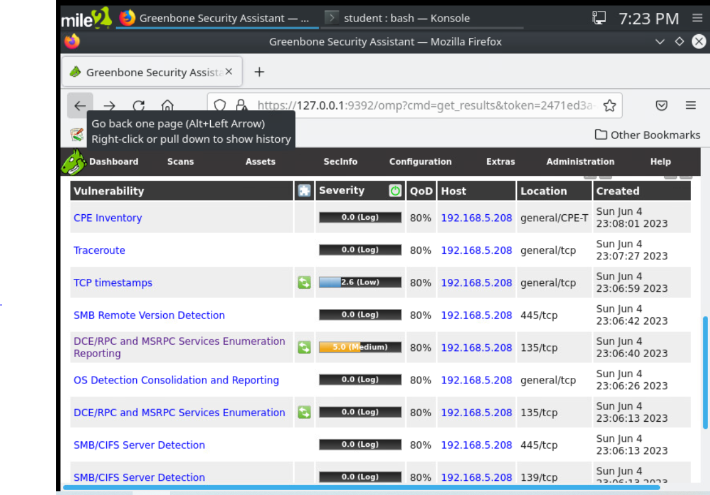

---

## 🔵 Defensive Tooling

### Snort IDS/IPS
Snort was deployed as a **listener on the Ubuntu host**, monitoring incoming traffic across the network in real time. Any signature match generated an alert — providing visibility into the opposing team's reconnaissance and exploit attempts.

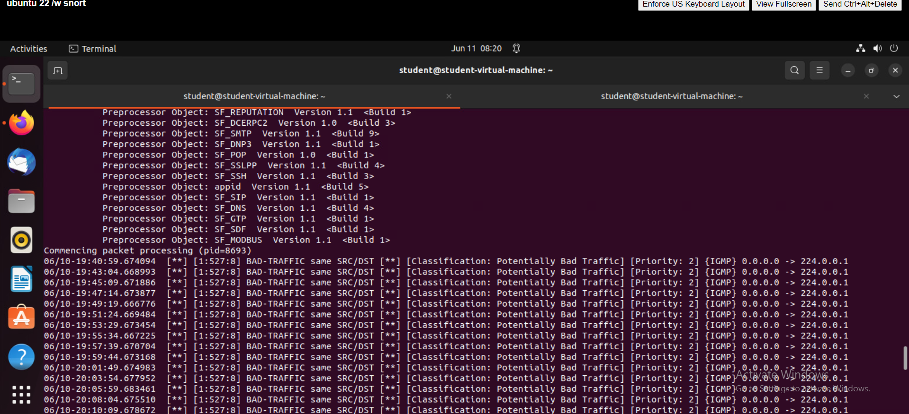

### Wireshark
Used for **live packet capture and traffic analysis** during the engagement window. Wireshark complemented Snort by allowing manual inspection of suspicious flows and protocol-level forensics.

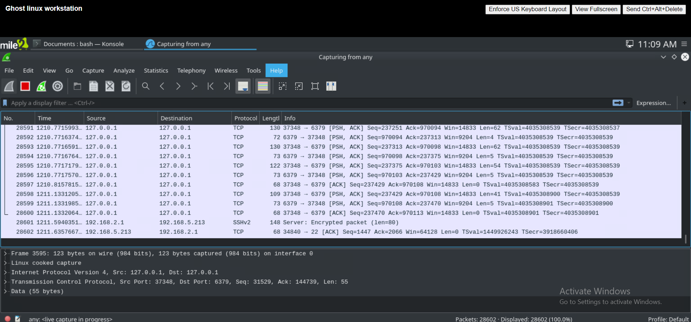

---

## 🔴 Offensive Operations (Against HASHCAT)

These tools were used against HASHCAT's environment — direct experience with each is what makes detection engineering against them possible.

### Zenmap — Reconnaissance
Network discovery and topology mapping against HASHCAT's `192.168.2.0/24` scope.

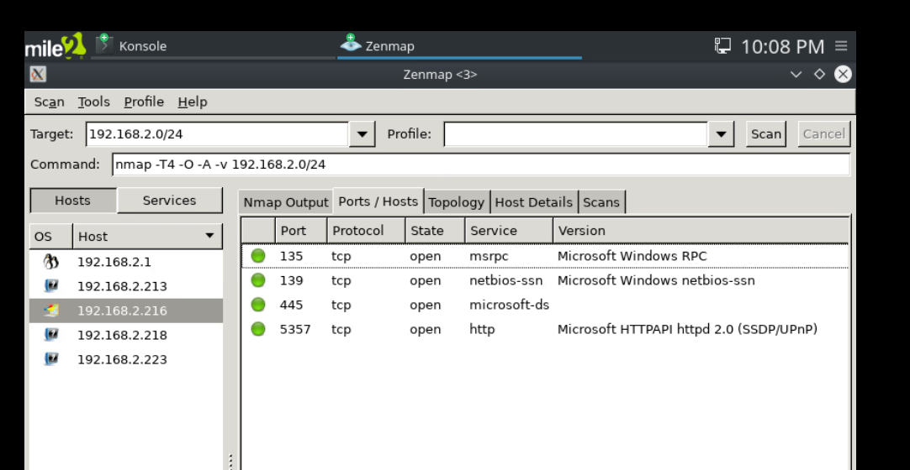

### Nmap — Vulnerability Scanning
Targeted CLI scans using `--script vuln` against discovered ports (especially SMB/445).

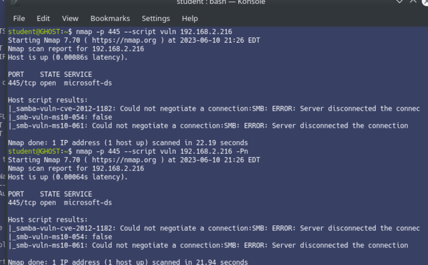

### Metasploit — MySQL `mysql_sql` auxiliary
Attempted authentication against MySQL on `192.168.2.214` with `student:P@ssw0rd`. **Connection refused** — HASHCAT had hardened or closed the service.

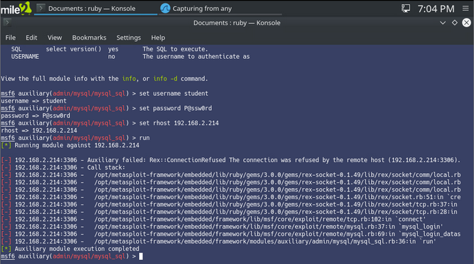

### Metasploit — MS08-067 NetAPI
Classic SMB vulnerability exploit (`exploit/windows/smb/ms08_067_netapi`) against `192.168.2.216` with `windows/meterpreter/reverse_tcp` payload (LHOST `192.168.5.213`, LPORT `4444`). Reverse handler started, exploit completed — **no session created.**

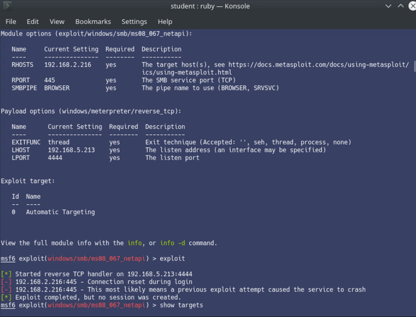

### Armitage — Hail Mary
Graphical Metasploit interface; used Hail Mary to automatically launch every applicable exploit against every discovered host. **No sessions returned.**

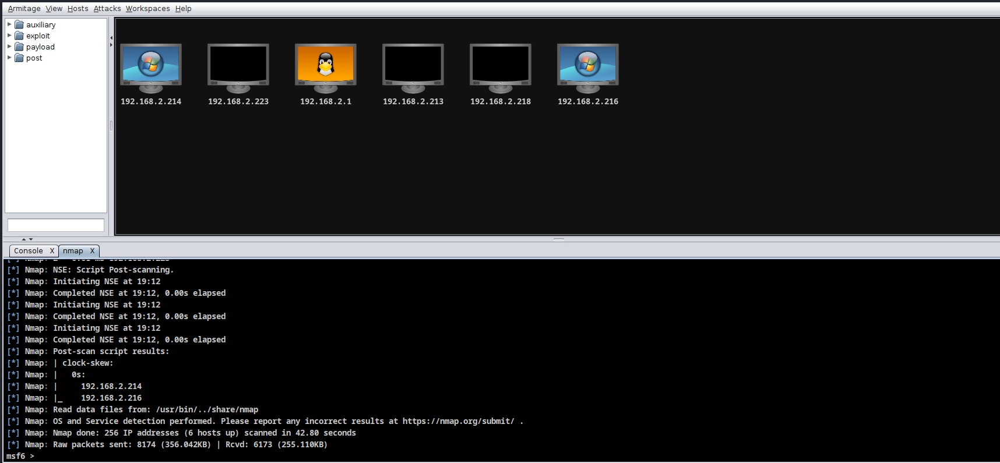

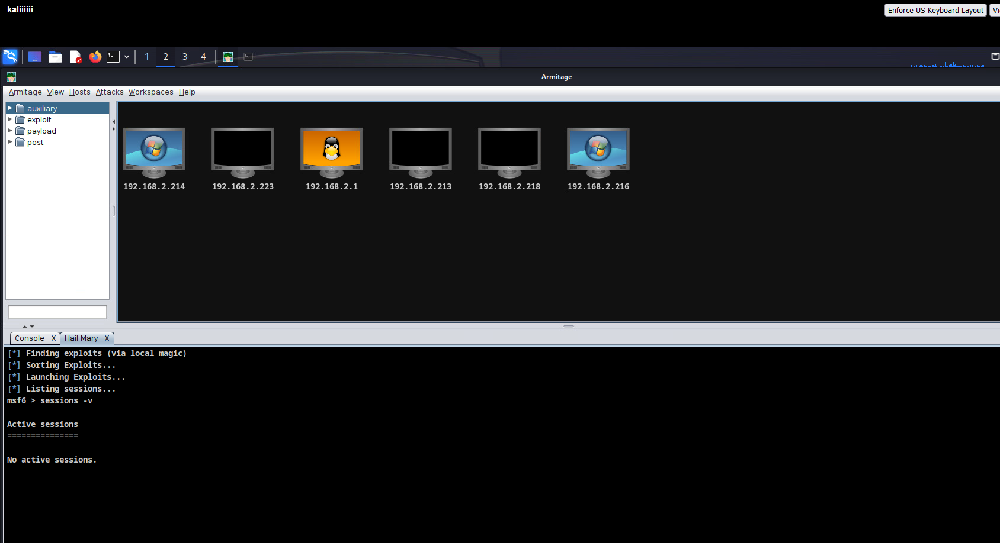

---

## 🔎 Findings & Detection Takeaways

Post-engagement findings:

- **Open ports detected** on multiple Windows hosts (135, 139, 445, 5357)
- **OS detection succeeded** on lightly-defended hosts (Windows 10 identified)
- **Two semi-exploitable workstations** at `192.168.2.216` and `192.168.2.214`
- **Three hardened hosts** (`192.168.2.213`, `.218`, `.232`) returned **unidentifiable**
- **Zero successful exploit sessions** across all attack tools

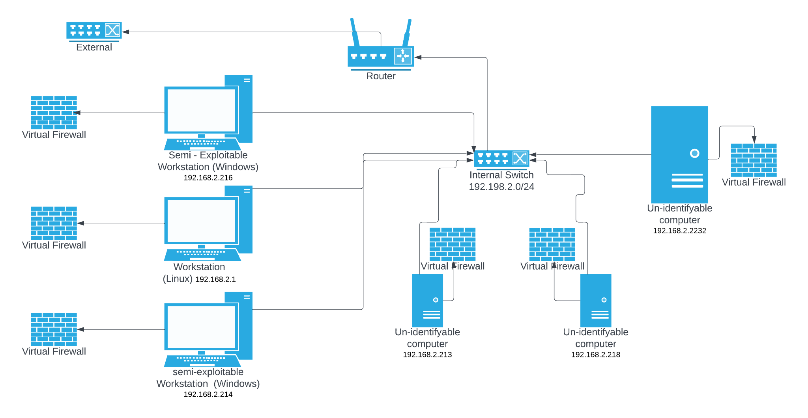

### Why this matters for a SOC

| Attack Pattern | Detection Opportunity |
|---|---|
| Wide-port Nmap scans | Snort signature: high SYN rate from single source |
| Metasploit reverse_tcp handler | EDR alert on outbound connection from `meterpreter` process; firewall egress rule on `4444` |
| Armitage Hail Mary | Spike in failed exploit attempts across many destinations from single source |
| MS08-067 attempts | Windows event logs + Snort SMB exploit signatures |

---

## 📄 Full Presentation

📑 [Schnaith pen test presentation.pdf](docs/Schnaith%20pen%20test%20presentation.pdf)

---

## ⚠️ Disclaimer

This project was conducted as part of an **academic red team vs. blue team penetration testing exercise**. All testing was performed on **isolated, privately owned virtual machines** in a controlled lab environment. No real-world systems, networks, or data were accessed or affected. All findings are for **educational purposes only**.
