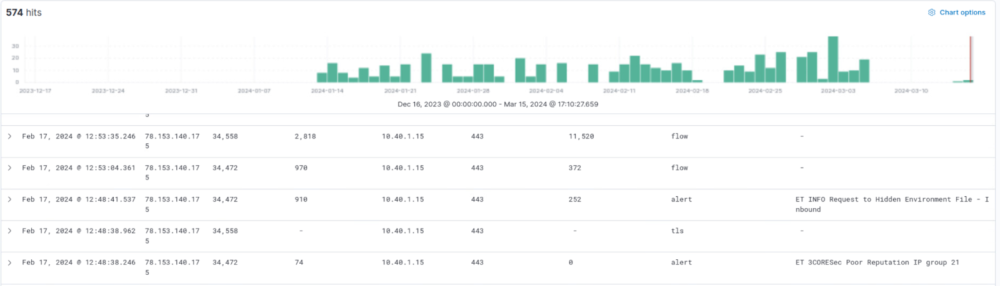
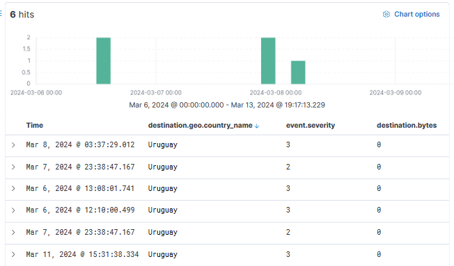
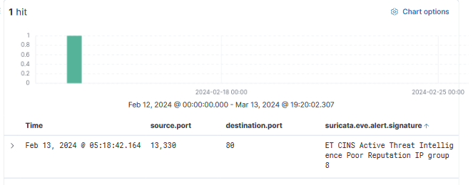

# 🛡️ SIEM Threat Analysis — Burien Municipal Network

> **SOC analyst work in practice.** Triaged alerts, hunted threats, and produced client-ready recommendations using Elastic SIEM and Suricata across a live municipal network.

**Role:** L1/L2 Analyst (Green Team) · **Client:** City of Burien · **SIEM Stack:** Elastic + Suricata
**Team:** Darci, Kyle, **William Schnaith**, Dylan, Edith, Chris

---

## 🎯 SOC Skills Demonstrated

| Skill | Evidence |
|---|---|
| **Alert Triage** | Investigated and classified 33 distinct threat cases |
| **Threat Hunting** | Pivoted on IP reputation, geolocation, and CVE indicators |
| **CVE Tracking** | Tracked active CVE-2024-1709 exploitation across the environment |
| **Persistence Detection** | Identified 90+ days of activity from a malicious subnet |
| **Rule Tuning** | Reduced false-positive load from benign web scanning |
| **Threat Intelligence** | Correlated geolocation patterns with known threat actors |
| **Reporting** | Authored formal client recommendations with severity ratings |

---

## 🔬 Investigation Methodology

```
ALERT  →  TRIAGE  →  VALIDATE  →  ENRICH  →  DOCUMENT  →  RECOMMEND
 │         │           │            │           │             │
 │         │           │            │           │             └─ Severity-rated client recommendation
 │         │           │            │           └─ Investigation notes + IOCs
 │         │           │            └─ Threat intel, geo, reputation feeds
 │         │           └─ Confirm true positive vs. false positive
 │         └─ Assess scope, severity, and asset criticality
 └─ Suricata signature triggers in Elastic
```

---

## 📋 Executive Summary

In response to the evolving threat landscape, our team conducted **33 comprehensive investigations** focusing on key areas of concern across the Burien municipal network. The investigations covered:

- Data movement patterns and lateral activity
- Origin analysis of "North/South" network traffic
- Alert signatures of well-known malware
- Indicators of malicious use of legitimate platforms
- Municipal network user behavior

Primary domains of observed or assumed malicious traffic included **web scanning, file sharing, simulated phishing campaigns,** and **initial-access attempts** through vulnerability enumeration and exploitation.

---

## 🚨 Key Findings

### 🔴 Finding 1 — CVE-2024-1709: ConnectWise ScreenConnect Auth Bypass

**Severity:** Critical · **MITRE ATT&CK:** [T1190 — Exploit Public-Facing Application](https://attack.mitre.org/techniques/T1190/)

| Observation | Detail |
|---|---|
| Initial-access vector | ConnectWise ScreenConnect entry vectors observed multiple times |
| Threat landscape | Mass exploitation observed industry-wide post-disclosure |
| Risk | Follow-on actions include ransomware and extortion (per Mandiant, Sophos X-Ops) |

**Recommendations:**
- 🔍 **Inventory** all ScreenConnect instances in the network
- 🔧 **Patch** to v23.9.10.8817 / v22.4 immediately
- 👁️ **Monitor** for post-exploit suspicious activity
- 🧪 **Test** with regular vulnerability assessments

---

### 🔴 Finding 2 — Malicious Subnet Persistence (90+ days)

**Severity:** High · **MITRE ATT&CK:** [T1071 — Application Layer Protocol](https://attack.mitre.org/techniques/T1071/)

Tickets **0005561** and **0005966** showed sustained communication to/from two compromised IPs on the same subnet:
- `78.153.140.175` and `78.153.140.173`
- First observed **2024-01-13**, blocking observed around **2024-03-05**
- As of **2024-03-14**: flow events from the IPs still received, no return traffic
- Alerts: **"Poor Reputation IP"** and **"Request to Hidden Environment File"**
- Volume: flow events with bytes in the **tens of thousands** despite alerts

**Recommendations:**
- Ensure flagged IPs are **blocked across all monitored clients**
- Implement **automated blocking** when poor-reputation alerts trigger
- Treat poor-reputation alerts as actionable, not informational



---

### 🟡 Finding 3 — Geolocation Threats (Uruguay, China)

**Severity:** Medium · **MITRE ATT&CK:** [T1595 — Active Scanning](https://attack.mitre.org/techniques/T1595/)

Threat hunting in Elastic surfaced repeated connection attempts from out-of-country hosts:
- **Uruguay** — over 90 days of persistent connection attempts, flooding Suricata alerts
- **China** — sporadic but sustained connection attempts
- Individually low-volume; collectively useful to attackers for reconnaissance

**Recommendations:**
- Implement a **geo-block firewall** for countries with no legitimate business interaction
- Maintain and update a **blocked countries / hostnames / IPs list** as new threats emerge
- Treat reconnaissance noise as an opportunity to harden, not just alert





---

### 🟡 Finding 4 — Phishing Awareness & Simulation Tracking

**Severity:** Medium · **MITRE ATT&CK:** [T1566 — Phishing](https://attack.mitre.org/techniques/T1566/)

Multiple alerts captured **users following links from simulated phishing emails** sent by training vendors (e.g. `payments.crypto.us`). Even simulated traffic provides valuable visibility into user behavior.

**Recommendations:**

| Layer | Action |
|---|---|
| 🎓 Training | Regular phishing-awareness training (red flags, generic messaging, urgency) |
| 🧪 Simulation | Recurring phishing simulations to assess organizational readiness |
| 🔐 Passwords | Strong unique passwords with rotation; password manager adoption |
| 📲 MFA | Enforce **multifactor authentication** across all accounts |

---

### 🟢 Finding 5 — Suricata Rule Tuning to Reduce False Positives

**Severity:** Low (Operational) · **Outcome:** Improved analyst efficiency

Extraordinary alert volumes were generated by **benign web scanning** (content scrapers, security vendors). Multiple hours were spent triaging these, demonstrating the operational cost of imprecise rules.

**Recommendations:**
- **Tailor Suricata rules** to the specific network environment and traffic patterns
- **Avoid overly broad signatures** that fire on benign activity
- Use Suricata's **thresholding, flowbit manipulation, and custom rules** to suppress noise
- **Tune iteratively** based on triage feedback — false-positive reduction is detection engineering

---

## 📄 Full Report

📑 [Schnaith. Burien Green Client Recommendations - Final.docx](docs/Schnaith.%20Burien%20Green%20Client%20Recommendations%20-%20Final.docx)

---

## ⚠️ Disclaimer

This report was produced as part of an **academic security analysis exercise**. All investigations were conducted on data from a monitored municipal network environment in an educational context. All findings and recommendations are for **educational and professional development purposes only**.
