# 🔐 SNORT vs HASHCAT — Penetration Test Presentation
**Team SNORT:** William Schnaith, Nassiah Almonte, Cesar Rodriguez-Ortiz, Lince Gombo
**Course:** CIS | **Format:** Red Team vs Blue Team | **Classification:** Academic / Simulated

---

## 📋 Table of Contents

- [Overview](#overview)
- [Contract Agreement](#contract-agreement)
- [Network Setup](#network-setup)
  - [Network Diagram](#network-diagram)
  - [Hardening](#hardening)
- [Tools Used](#tools-used)
  - [WireShark](#-wireshark)
  - [Snort IDS/IPS](#-snort-idsips)
  - [Zenmap](#-zenmap)
  - [Nmap](#-nmap)
  - [Metasploit — MySQL](#-metasploit--mysql)
  - [Metasploit — NetAPI](#-metasploit--netapi)
  - [Armitage](#-armitage)
- [Findings](#findings)
- [Disclaimer](#disclaimer)

---

## Overview

This project was a **red team vs blue team penetration testing exercise** between two student groups — **Team SNORT** and **Team HASHCAT**. Each team was responsible for:

1. **Building a virtualized network from scratch** using VMware and configuring all hosts, firewalls, switches, and servers
2. **Hardening their own network** against attacks using security tools and best practices
3. **Attempting to penetrate the opposing team's network** using real-world offensive security tools

The exercise simulated a realistic engagement where both teams signed a formal penetration testing contract, defined the scope of testing, and then carried out offensive operations against each other's infrastructure — all within a controlled, academic environment.

---

## Contract Agreement

Before any testing began, both teams signed a formal **Contract for Penetration Testing** establishing the rules of engagement. The contract defined:

- All assets approved as in-scope targets for testing
- The testing window: **Saturday, July 10, 2023** (12:00 AM – 11:59 PM)
- Internal IP scope: `192.168.2.0/24`
- Client (HASHCAT) and Provider (SNORT) signatures and agreement dates

This ensured all testing was authorized, scoped, and conducted legally and ethically within the simulation.

---

## Network Setup

### Network Diagram

Team SNORT built a fully virtualized internal network from scratch. The network included multiple machines across different roles, each protected by virtual firewalls and connected through an internal switch.

| Host | OS | IP Address | Role |
|------|----|-----------|------|
| Exploitable Workstation | Windows 10 | `192.168.5.207` | Intentionally vulnerable target |
| Linux Workstation | Ubuntu | `192.168.5.201` | Standard workstation |
| Windows Workstation | Windows 10 | `192.168.5.203` | Standard workstation |
| Windows Server | Windows Server | `192.168.5.204` | Domain Controller |
| Windows Server | Windows Server | `192.168.5.202` | Member Server |
| Linux Server | Linux | `192.168.5.206` | Linux server |

All internal machines were connected through an **Internal Switch** and protected by **Virtual Firewalls**. External traffic was routed through a **pfSense LAN** and main firewall before reaching the internal network.

**Network Diagram — Team SNORT's virtualized infrastructure**

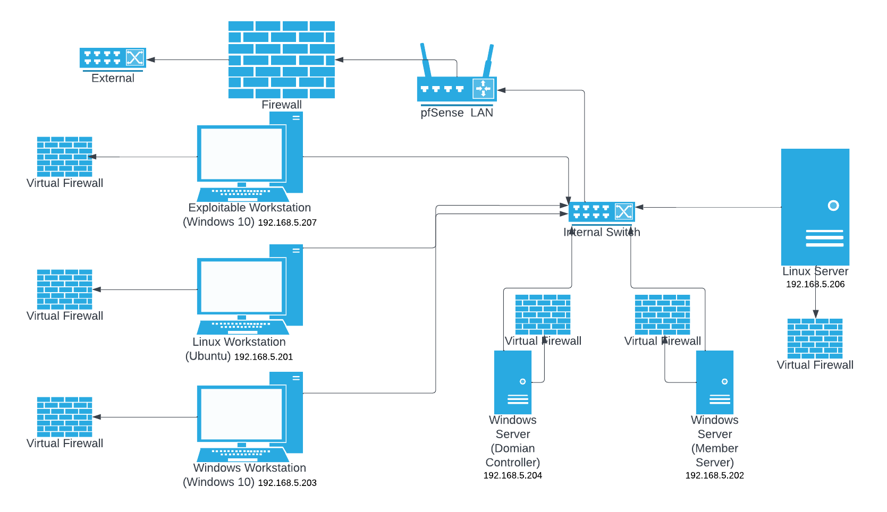

---

### Hardening

Before the penetration test began, Team SNORT hardened their network to reduce the attack surface. The following measures were taken:

- **OpenVAS** — ran vulnerability scans against all internal hosts to identify and remediate weaknesses before the opposing team could exploit them
- **Updates** — ensured all operating systems and software were fully patched
- **Firewalls** — configured virtual firewalls on all machines to restrict unnecessary inbound and outbound traffic
- **Passwords** — enforced strong password policies across all accounts

**Hardening Screenshot — OpenVAS vulnerability scan results on internal hosts**

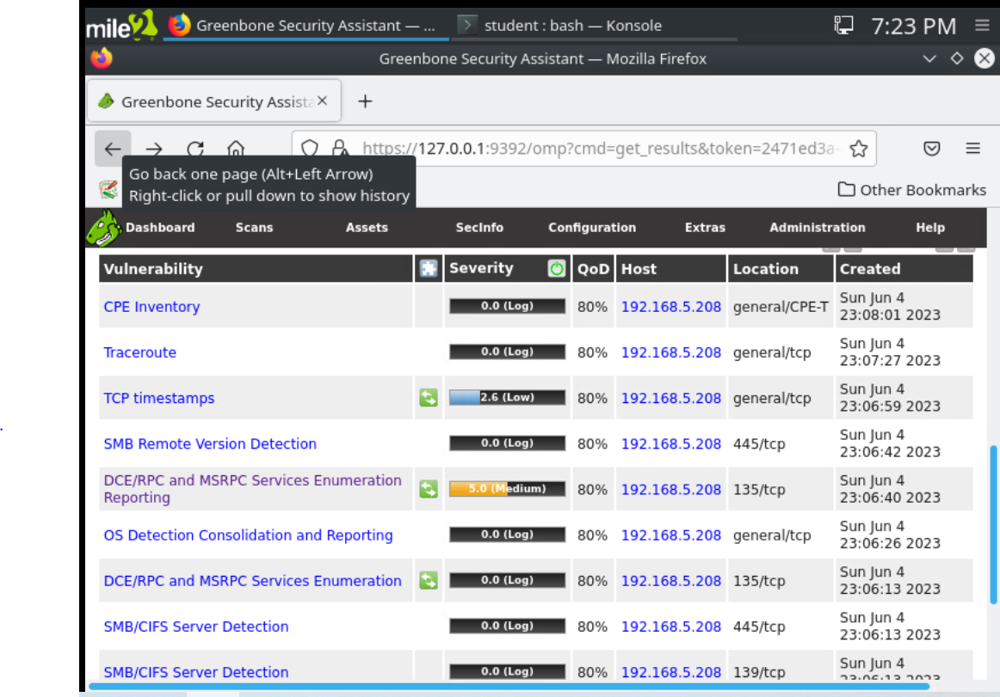

---

## Tools Used

### 🔵 WireShark

**WireShark** is an open-source network protocol analyzer that captures and analyzes network traffic in real time. It allows inspection of individual packets flowing over the network, including source and destination IP addresses, protocols used, and packet contents.

During this exercise, WireShark was used to **monitor live network traffic** on the SNORT network, helping the team understand what traffic was flowing and detect any suspicious activity from the opposing team's attacks.

**Uses:**
- Packet capture and inspection
- Protocol troubleshooting
- Detecting anomalous traffic patterns

**WireShark in use — capturing live packets on the SNORT network**

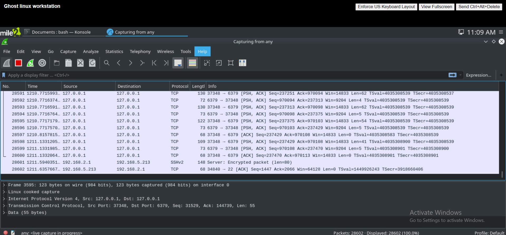

---

### 🔴 Snort IDS/IPS

**Snort** is an open-source network intrusion detection and prevention system (IDS/IPS). It monitors network traffic in real time and detects potential security threats and malicious activity based on predefined rule sets.

Team SNORT deployed Snort as a **listener on their Ubuntu machine** to monitor all incoming traffic and generate alerts when suspicious patterns were detected — providing visibility into any attack attempts from Team HASHCAT.

**Uses:**
- Intrusion detection and prevention
- Real-time network security monitoring
- Alert generation on suspicious traffic

**Snort running on Ubuntu — detecting and classifying network traffic**

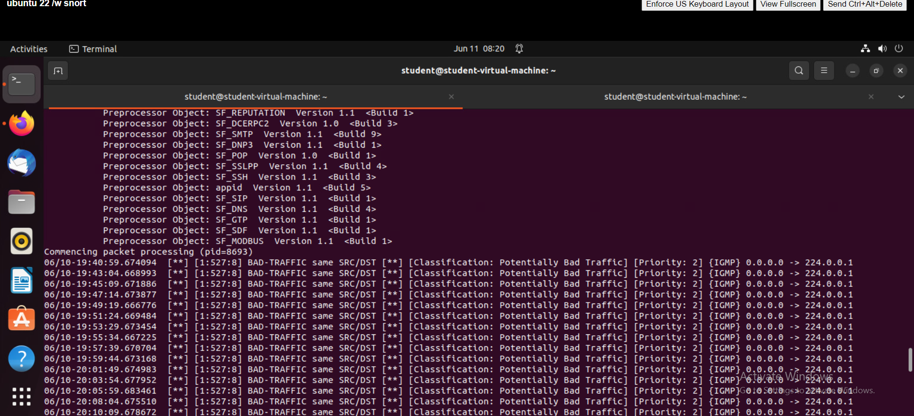

---

### 🔵 Zenmap

**Zenmap** is the graphical front-end for Nmap. It was used during the offensive phase to perform network scanning against Team HASHCAT's infrastructure, discovering active hosts, open ports, running services, and the overall network topology.

**Uses:**
- Network scanning and host discovery
- Open port enumeration
- Network mapping and topology visualization

**Zenmap scan — mapping HASHCAT's network and discovering open services**

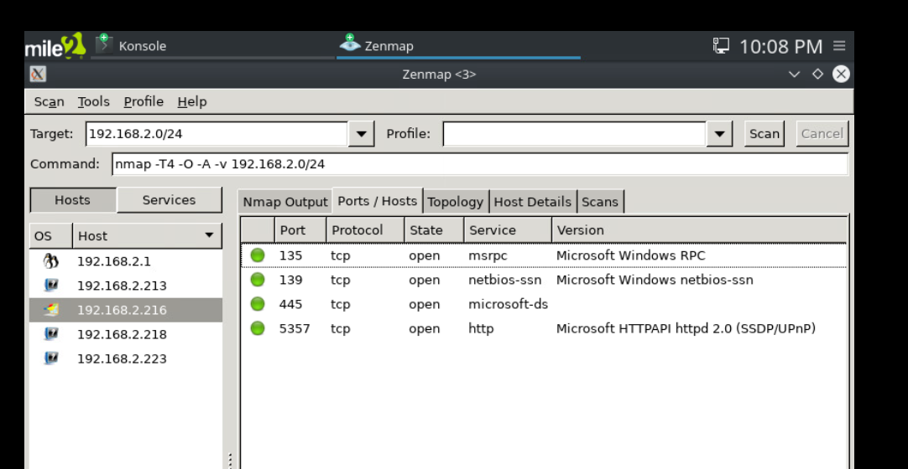

---

### 🔴 Nmap

**Nmap** was used in command-line form to run **vulnerability-specific scans** against HASHCAT's machines. By targeting specific ports with Nmap's scripting engine (`--script vuln`), the team was able to probe for known vulnerabilities on discovered hosts.

**Uses:**
- Discovering network vulnerabilities on specific ports
- Running NSE (Nmap Scripting Engine) scripts for vulnerability detection

**Nmap vulnerability scan — probing port 445 on HASHCAT's Windows machine**

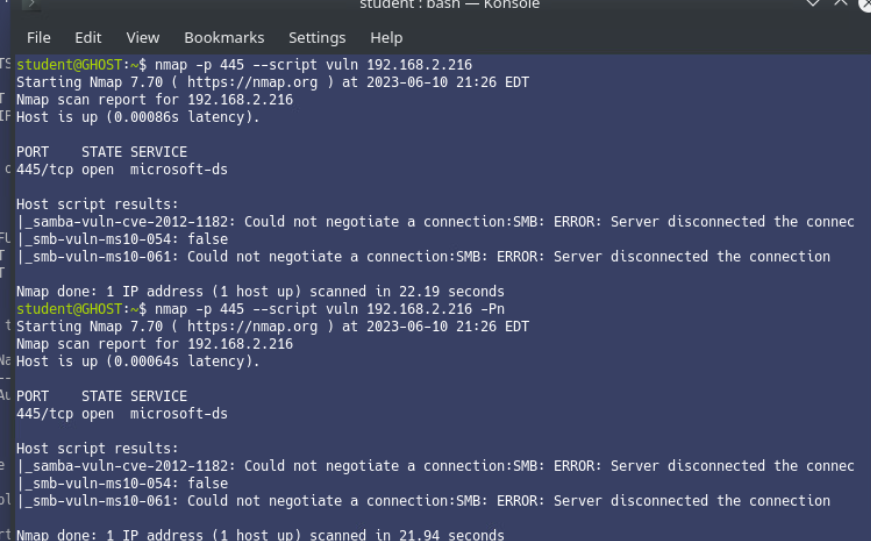

---

### 🔴 Metasploit — MySQL

**Metasploit** is an industry-standard exploitation framework used by penetration testers to discover and exploit vulnerabilities. In the first attempt, Team SNORT used Metasploit's `mysql_sql` auxiliary module to attempt to authenticate to a MySQL database on HASHCAT's network.

The module was configured with:
- **RHOSTS:** `192.168.2.214`
- **Username:** `student`
- **Password:** `P@ssw0rd`

The connection was ultimately refused, indicating that HASHCAT had hardened or closed access to their MySQL service — a sign of effective network hardening by the opposing team.

**Metasploit MySQL attempt — connection refused on HASHCAT's machine**

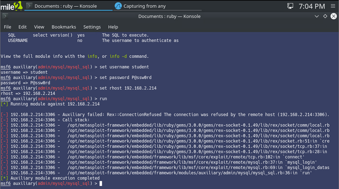

---

### 🔴 Metasploit — NetAPI

In a second exploitation attempt, Team SNORT used the **MS08-067 NetAPI exploit** (`exploit/windows/smb/ms08_067_netapi`) — a classic Windows SMB vulnerability — against HASHCAT's Windows machine at `192.168.2.216`.

The payload used was `windows/meterpreter/reverse_tcp` with:
- **LHOST:** `192.168.5.213`
- **LPORT:** `4444`

While a reverse TCP handler was started and a connection was attempted, the exploit completed without creating an active session — again indicating that HASHCAT's hardening measures were effective in preventing a full compromise.

**Metasploit NetAPI exploit attempt — no active session created**

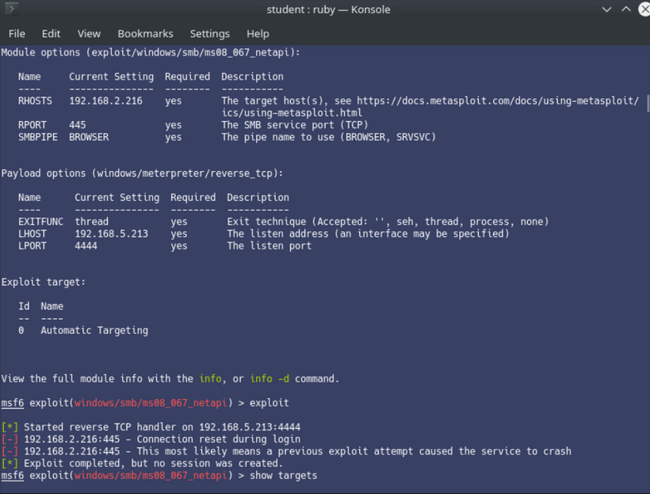

---

### 🔴 Armitage

**Armitage** is a graphical cyber attack management tool built on top of Metasploit. It provides a visual interface for managing discovered hosts, running exploits, and coordinating attacks. Team SNORT used Armitage to get a visual overview of HASHCAT's network and launch a **Hail Mary** attack — an automated scan that attempts every applicable exploit against all discovered hosts simultaneously.

The Hail Mary attack found and sorted applicable exploits and launched them, but ultimately returned **no active sessions**, confirming that HASHCAT's network defenses held up against the automated attack.

**Armitage — network overview showing all discovered HASHCAT hosts**

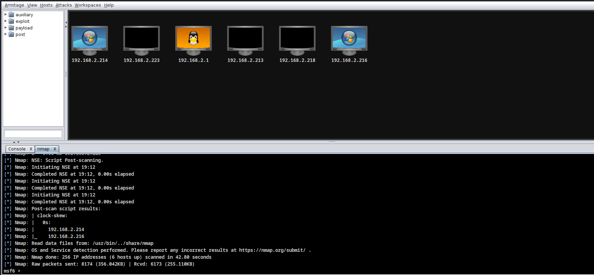

**Armitage — Hail Mary automated exploit attempt, no sessions created**

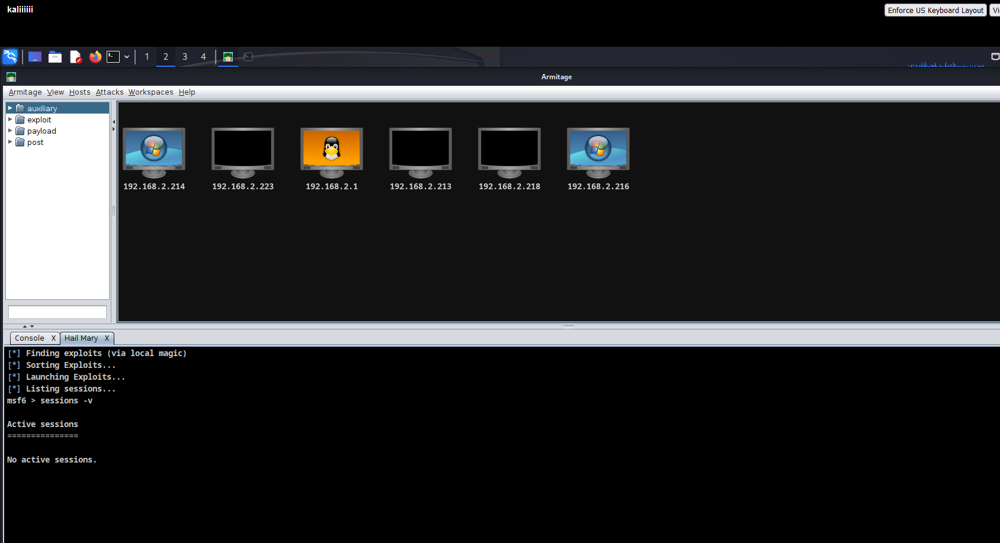

---

## Findings

After completing all offensive operations against HASHCAT's network, Team SNORT produced a post-test network diagram based on what was discovered during scanning. Key findings included:

- **Open ports detected** on multiple Windows machines (ports 135, 139, 445, 5357)
- **OS detection successful** — several machines were identified as Windows 10
- **Semi-exploitable workstations** identified at `192.168.2.216` and `192.168.2.214`
- **Un-identifiable computers** at `192.168.2.213`, `192.168.2.218`, and `192.168.2.2232` — indicating strong hardening on those hosts
- All exploit attempts were **unsuccessful in creating active sessions**, demonstrating that HASHCAT's hardening efforts were effective

**Post-test network diagram — discovered topology of HASHCAT's network**

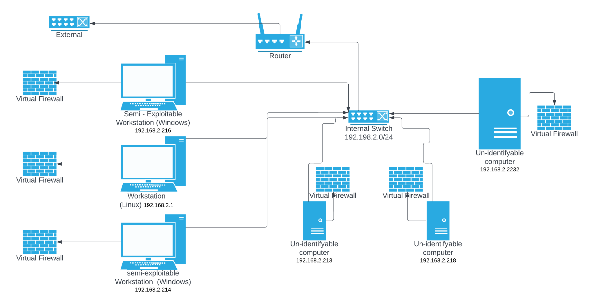

---

## Disclaimer

> ⚠️ This project was conducted as part of an **academic red team vs blue team penetration testing exercise**. All testing was performed on **isolated, privately owned virtual machines** in a controlled lab environment. No real-world systems, networks, or data were accessed or affected at any time. All findings are for **educational purposes only**.
